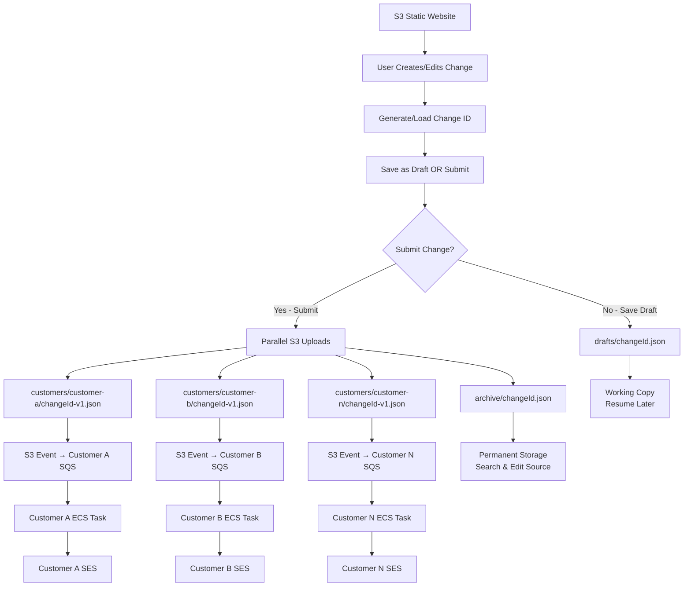

# Multi-Customer Email Distribution Architecture Design

## Overview

This design addresses the challenge of distributing change management emails across ~30 customer AWS Organizations while maintaining isolation, security, and scalability. The solution must trigger customer-specific containerized processes based on metadata that identifies affected customers.

## Architecture

### High-Level Architecture

#### Direct S3 → SQS per Customer (Ultimate Simplicity)



**Key Benefits:**

- **No Lambda Router**: S3 events go directly to customer SQS queues
- **No Fan-out Logic**: Upload same file to each customer's prefix
- **Perfect Isolation**: Each customer only sees their own S3 events
- **Minimal S3 Cost**: Storage duplication cost is negligible
- **Zero Complexity**: No parsing, routing, or orchestration needed
- **Natural Scaling**: Each customer operates independently

### Core Components

#### 1. S3 Static Website (Change Management Portal) with Identity Center Auth

- **Location**: S3 bucket with static website hosting behind CloudFront
- **Authentication**: AWS IAM Identity Center (SSO) integration
- **Purpose**: Comprehensive change management portal for creating and viewing metadata
- **Site Structure**:

  ```
  /index.html          - Dashboard/Home page with recent changes
  /create-change.html  - Create new change form
  /edit-change.html    - Edit existing change (loads by changeId parameter)
  /view-changes.html   - Browse and display existing changes
  /search-changes.html - Search changes by ID, title, customer, etc.
  /my-changes.html     - User's own changes (drafts and submitted)
  /profile.html        - User profile and permissions
  /assets/            - CSS, JavaScript, and other static assets
  ```

- **Page Capabilities**:
  - **Dashboard**: Recent changes, drafts needing attention, quick actions, system status
  - **Create Change**: Responsive form for new changes with draft saving capability
  - **Edit Change**: Load existing change by ID, modify, and resubmit with version tracking
  - **View Changes**: Browse changes with status, version history, and detailed display
  - **Search Changes**: Filter by changeId, title, customer, status, date range, or keywords
  - **My Changes**: User's personal dashboard of drafts, submitted, and completed changes
  - **Profile**: Show user permissions, accessible customers, and preferences
- **Core Features**:
  - Authenticate users via Identity Center SAML/OIDC
  - Generate properly formatted metadata.json client-side
  - Upload metadata directly to S3 using temporary AWS credentials
  - Browse and display existing metadata files from S3 archive
  - Search and filter capabilities for archived changes
  - Role-based navigation and feature access
  - Responsive design with consistent navigation
- **Benefits**:
  - Complete change management workflow in one portal
  - Self-service metadata viewing and investigation
  - Enterprise-grade authentication and authorization
  - Single sign-on with existing corporate identity providers
  - Fine-grained permissions based on Identity Center groups
  - Audit trail of who submitted and viewed which changes
  - No server infrastructure required

#### 2. S3 Event Notifications (No Lambda Router Needed)

- **Configuration**: S3 bucket configured with event notifications per customer prefix
- **Trigger**: Direct S3 → SQS integration for each customer prefix
- **Purpose**: Automatically deliver S3 events to appropriate customer SQS queues
- **Benefits**:
  - Zero infrastructure to maintain
  - Perfect customer isolation
  - No single point of failure
  - Unlimited scalability
  - Minimal cost (just S3 event notifications)

#### 3. Customer-Specific Message Queues

- **Technology**: Amazon SQS (one queue per customer organization)
- **Location**: Each customer's AWS organization
- **Message Format**: Reference to metadata location + action type
- **Benefits**:
  - Natural isolation between customers
  - Built-in retry and dead letter queue capabilities
  - Scalable and reliable message delivery
  - Cost-effective for intermittent workloads

#### 3. Customer ECS Tasks

- **Current Implementation**: Existing AWS Alternate Contact Manager CLI
- **Trigger**: SQS message arrival
- **Execution**: ECS task triggered by SQS message
- **Isolation**: Runs within customer's own AWS organization

## Components and Interfaces

### S3 Static Website Interface

```yaml
Site Navigation:
  Header Navigation:
    - Dashboard (Home)
    - Create Change
    - View Changes
    - Search Changes
    - Profile
    - Logout

Page Workflows:

  Dashboard (/index.html):
    1. Display recent changes submitted by user
    2. Show system status and statistics
    3. Quick action buttons for common tasks
    4. Notifications and alerts

  Create Change (/create-change.html):
    1. Fill out change management form (title, customers, schedule, etc.)
    2. Select action type (approval-request, notification, meeting-invite)
    3. Preview generated metadata.json
    4. Click "Generate & Submit" button
    5. JavaScript generates metadata.json and uploads to S3 trigger bucket

  View Changes (/view-changes.html):
    1. Browse paginated list of metadata files from S3 archive
    2. Filter by date range, customer, or change type
    3. Click on any metadata file to view formatted content
    4. Display metadata with syntax highlighting and collapsible sections
    5. Show execution status and customer delivery results

  Search Changes (/search-changes.html):
    1. Advanced search form with multiple filter criteria
    2. Full-text search within metadata content
    3. Date range picker for time-based filtering
    4. Customer and change type multi-select filters
    5. Export search results to CSV or JSON

Authentication & Upload Architecture:

  Identity Center + CloudFront + Lambda@Edge Implementation:
    - CloudFront distribution serves S3 static website content
    - Lambda@Edge function intercepts requests for authentication
    - Identity Center SAML/OIDC integration provides enterprise SSO
    - JWT tokens from Identity Center contain user attributes and permissions
    - Lambda@Edge validates JWT tokens and user permissions
    - Authenticated users receive temporary AWS credentials via STS AssumeRoleWithWebIdentity
    - Direct S3 upload using temporary credentials with customer-specific permissions
    - Complete audit trail of user actions and file uploads
    - Automatic token refresh and session management

Detailed Authentication Workflow:
  1. User accesses CloudFront URL for metadata collector
  2. Lambda@Edge (viewer-request) checks for valid JWT token in cookies
  3. If no token or expired token:
     a. Lambda@Edge redirects to Identity Center login URL
     b. User authenticates with corporate credentials (SSO)
     c. Identity Center returns JWT token with user attributes
     d. Lambda@Edge sets secure HTTP-only cookie with JWT
  4. Lambda@Edge (viewer-request) validates JWT token signature and expiration
  5. Lambda@Edge extracts user permissions from JWT claims
  6. If authorized, request proceeds to S3 static website
  7. JavaScript on page calls Lambda@Edge endpoint to exchange JWT for AWS credentials
  8. Lambda@Edge (origin-request) uses STS AssumeRoleWithWebIdentity
  9. Returns temporary AWS credentials scoped to user's customer permissions
  10. JavaScript uses credentials for direct S3 upload with customer-specific prefix

JavaScript Functions:

  Authentication & Core:
    - checkAuthentication() -> Promise<boolean>
    - redirectToLogin() -> void
    - exchangeTokenForCredentials(jwtToken) -> Promise<AWSCredentials>
    - handleAuthError(error) -> void
    - initializeNavigation() -> void
    - updateUserProfile(userInfo) -> void

  Create Change Page:
    - validateForm() -> boolean
    - generateMetadata() -> JSON
    - previewMetadata(metadata) -> void
    - uploadToS3WithCredentials(metadata, credentials) -> Promise<response>
    - showUploadStatus(status) -> void

  View Changes Page:
    - listMetadataFiles(prefix, pageToken) -> Promise<FileList>
    - loadMetadataFile(s3Key) -> Promise<JSON>
    - displayMetadata(metadata, container) -> void
    - formatMetadataForDisplay(metadata) -> HTML
    - filterFilesByDate(files, startDate, endDate) -> FileList
    - paginateResults(files, pageSize, currentPage) -> PaginatedResults

  Search Changes Page:
    - buildSearchQuery(criteria) -> SearchQuery
    - searchMetadataContent(query) -> Promise<SearchResults>
    - applyFilters(files, filters) -> FilteredResults
    - exportResults(results, format) -> void
    - highlightSearchTerms(content, terms) -> HTML

  Dashboard Page:
    - loadRecentChanges(limit) -> Promise<ChangeList>
    - getSystemStatus() -> Promise<StatusInfo>
    - displayQuickActions(userPermissions) -> void
    - loadNotifications() -> Promise<NotificationList>

Permission Model:
  - ChangeManager Role: Can submit all change types for all customers
  - CustomerManager Role: Can submit changes only for assigned customers
  - ReadOnly Role: Can view form but cannot submit changes
  - Auditor Role: Can access archived metadata for investigation
```

### S3 Event Configuration (No Lambda Router Needed)

```yaml
S3 Bucket Event Notifications:
  customers/customer-a/*:
    - Destination: Customer A SQS Queue
    - Events: s3:ObjectCreated:*
    - Filter: prefix="customers/customer-a/" suffix=".json"
    
  customers/customer-b/*:
    - Destination: Customer B SQS Queue  
    - Events: s3:ObjectCreated:*
    - Filter: prefix="customers/customer-b/" suffix=".json"
    
  customers/customer-n/*:
    - Destination: Customer N SQS Queue
    - Events: s3:ObjectCreated:*
    - Filter: prefix="customers/customer-n/" suffix=".json"

SQS Message Format (from S3 Event):
  Records[0]:
    s3:
      bucket: metadata-trigger-bucket
      object: 
        key: customers/customer-a/change-123.json
        size: 2048
    eventName: ObjectCreated:Put
```

### Web Interface with Change Management Lifecycle

```yaml
Create New Change:
  1. User fills out form with change details
  2. Generate unique changeId (GUID) and set version=1, status="draft"
  3. Save to drafts/{changeId}.json for editing (optional)
  4. User can preview, edit, and save multiple times
  5. When ready, user clicks "Submit Change"
  6. Upload to operational and archive locations
  
Modify Existing Change:
  1. User searches/browses existing changes by changeId or title
  2. Load change from archive/{changeId}.json
  3. Pre-populate form with existing data
  4. User makes modifications
  5. Increment version number, update modifiedAt/modifiedBy
  6. Save updated version to all locations
  7. Send "change updated" notifications to affected customers

Upload Logic (New or Modified):
  Draft Save:
    - Upload to drafts/{changeId}.json (working copy only)
    
  Submit Change:
    Single Customer Change:
      - Upload to customers/{customer-code}/{changeId}-v{version}.json (triggers SQS)
      - Upload to archive/{changeId}.json (permanent storage, latest version)
      - Remove from drafts/{changeId}.json (optional cleanup)
      
    Multi-Customer Change:
      - Upload to each customers/{customer-code}/{changeId}-v{version}.json
      - Upload single copy to archive/{changeId}.json (permanent storage)
      - Remove from drafts/{changeId}.json (optional cleanup)

JavaScript Functions:
  - generateChangeId() -> string (GUID)
  - loadExistingChange(changeId) -> Promise<metadata>
  - loadDraft(changeId) -> Promise<metadata>
  - searchChanges(criteria) -> Promise<changeList>
  - saveAsDraft(metadata) -> Promise<response>
  - submitChange(metadata) -> Promise<results>
  - updateExistingChange(metadata) -> Promise<results>
  - uploadToAllLocations(metadata, isUpdate) -> Promise<results>

S3 Storage Structure:
  drafts/{changeId}.json - Working copies for editing (optional)
  customers/{code}/{changeId}-v{version}.json - Operational triggers (auto-deleted after 30 days)
  archive/{changeId}.json - Permanent storage for search and editing
```

### Customer Process Interface

```yaml
Input:
  - SQS message containing:
    - action_type: string
    - customer_code: string
    - execution_id: string
    - timestamp: string
    - metadata: object (complete metadata embedded in message)

Processing:
  - Parse embedded metadata from SQS message
  - Execute specified action using existing CLI with embedded metadata
  - Report completion status (optional)

Output:
  - Email delivery via customer's SES
  - Status logging to customer's CloudWatch (optional)
```

## Data Models

### Enhanced Metadata Format with Change ID

```json
{
  "changeId": "550e8400-e29b-41d4-a716-446655440000",
  "version": 1,
  "createdAt": "2025-09-20T15:30:00Z",
  "modifiedAt": "2025-09-20T15:30:00Z",
  "createdBy": "user@company.com",
  "modifiedBy": "user@company.com",
  "status": "draft|submitted|approved|completed|cancelled",
  "changeMetadata": {
    "title": "Configure Proof-of-Value exercise with FinOut",
    "customerNames": ["Customer A", "Customer B"],
    "customerCodes": ["customer-a", "customer-b"],
    "tickets": {
      "serviceNow": "CHG0123456",
      "jira": "INFRA-2847"
    },
    "schedule": {
      "implementationStart": "2025-09-20T10:00",
      "implementationEnd": "2025-09-20T17:00",
      "beginDate": "2025-09-20",
      "beginTime": "10:00",
      "endDate": "2025-09-20",
      "endTime": "17:00",
      "timezone": "America/New_York"
    },
    "changeReason": "Evaluate new cost management platform",
    "implementationPlan": "Deploy FinOut platform in test environment",
    "testPlan": "Validate cost data ingestion and reporting",
    "expectedCustomerImpact": "No customer impact expected",
    "rollbackPlan": "Remove FinOut configuration if issues arise"
  },
  "emailNotification": {
    "subject": "ITSM Change Notification: Configure Proof-of-Value exercise"
  },
  "meetingInvite": {
    "title": "Change Implementation Meeting",
    "startTime": "2025-09-20T10:00",
    "duration": 420,
    "location": "Microsoft Teams"
  }
}
```

### S3 Storage Structure (Simple - Phase 1)

```
s3://metadata-trigger-bucket/
├── customers/ (temporary operational files with lifecycle deletion)
│   ├── customer-a/
│   │   ├── changeId-v1-2025-09-20T15-30-45.json (deleted after 30 days)
│   │   ├── changeId-v1-2025-09-20T16-45-12.json (deleted after 30 days)
│   │   └── changeId-v2-2025-09-20T15-45-30.json (updated version, deleted after 30 days)
│   ├── customer-b/
│   │   ├── changeId-v1-2025-09-20T10-15-30.json (deleted after 30 days)
│   │   └── changeId-v2-2025-09-20T15-45-30.json (updated version, deleted after 30 days)
├── drafts/ (optional working copies)
│   ├── changeId-abc123.json (working copy for editing)
│   └── changeId-def456.json (working copy for editing)
└── archive/ (permanent storage - simple structure)
    ├── 2025/
    │   └── 09/
    │       └── 20/
    │           ├── changeId-abc123-v1.json (permanent copy)
    │           ├── changeId-def456-v1.json (permanent copy)
    │           └── changeId-abc123-v2.json (updated version)
    └── latest/
        ├── changeId-abc123.json -> ../2025/09/20/changeId-abc123-v2.json
        └── changeId-def456.json -> ../2025/09/20/changeId-def456-v1.json
```

**Phase 1 Benefits:**
- Simple date-based organization for easy browsing
- Latest symlinks for quick access to current versions
- Minimal complexity for initial implementation
- Easy to search and understand structure

**Upload and Lifecycle Strategy:**

- **Single Customer Changes**:
  - Upload to `customers/{customer-code}/filename.json` (triggers SQS)
  - Upload to `archive/YYYY/MM/DD/filename.json` (permanent storage)
- **Multi-Customer Changes**:
  - Upload to each `customers/{customer-code}/filename.json` (triggers each customer's SQS)
  - Upload single copy to `archive/YYYY/MM/DD/filename.json` (permanent storage)
- **Lifecycle Policy**: Delete all files in `customers/` prefix after 30 days
- **Cost Optimization**: Only permanent archive copy remains long-term
- **Audit Trail**: Complete history preserved in date-partitioned archive
- **Zero Long-term Duplication Cost**: Operational copies automatically cleaned up

## Infrastructure as Code (Terraform)

### Required Terraform Modules

#### 1. Central Infrastructure (Management Account)

```hcl
# S3 Bucket for metadata storage and static website
module "metadata_bucket" {
  source = "./modules/s3-metadata-bucket"
  
  bucket_name = "multi-customer-change-metadata"
  lifecycle_rules = {
    customers_prefix_deletion = {
      prefix = "customers/"
      expiration_days = 30
    }
  }
  event_notifications = var.customer_sqs_queues
  cors_configuration = true
  static_website_hosting = true
}

# CloudFront distribution for static website
module "cloudfront_distribution" {
  source = "./modules/cloudfront-identity-center"
  
  s3_bucket_domain = module.metadata_bucket.website_endpoint
  identity_center_domain = var.identity_center_domain
  lambda_edge_functions = {
    viewer_request = module.lambda_edge_auth.viewer_request_arn
    origin_request = module.lambda_edge_auth.origin_request_arn
  }
}

# Lambda@Edge for Identity Center authentication
module "lambda_edge_auth" {
  source = "./modules/lambda-edge-auth"
  
  identity_center_issuer = var.identity_center_issuer
  jwt_signing_key = var.identity_center_jwt_key
  customer_permissions = var.customer_access_mappings
}

# IAM roles for user access
module "user_access_roles" {
  source = "./modules/iam-user-roles"
  
  identity_center_provider_arn = var.identity_center_provider_arn
  customer_mappings = var.customer_access_mappings
  s3_bucket_arn = module.metadata_bucket.bucket_arn
}
```

#### 2. Customer Infrastructure (Per Customer Account)

```hcl
# SQS queue for change notifications
module "change_notification_queue" {
  source = "./modules/sqs-change-queue"
  
  customer_code = var.customer_code
  dead_letter_queue_enabled = true
  visibility_timeout = 900  # 15 minutes for ECS task
  message_retention_period = 1209600  # 14 days
}

# ECS service for processing changes
module "change_processor_ecs" {
  source = "./modules/ecs-change-processor"
  
  customer_code = var.customer_code
  sqs_queue_arn = module.change_notification_queue.queue_arn
  container_image = var.aws_alternate_contact_manager_image
  task_cpu = 256
  task_memory = 512
  auto_scaling = {
    min_capacity = 0
    max_capacity = 5
    target_cpu_utilization = 70
  }
}

# CloudWatch monitoring and alarms
module "monitoring" {
  source = "./modules/cloudwatch-monitoring"
  
  customer_code = var.customer_code
  sqs_queue_name = module.change_notification_queue.queue_name
  ecs_service_name = module.change_processor_ecs.service_name
  alert_sns_topic = var.alert_sns_topic
}
```

#### 3. Cross-Account Permissions

```hcl
# Cross-account SQS permissions
resource "aws_sqs_queue_policy" "cross_account_access" {
  queue_url = module.change_notification_queue.queue_url
  
  policy = jsonencode({
    Statement = [{
      Effect = "Allow"
      Principal = {
        AWS = var.central_account_role_arn
      }
      Action = [
        "sqs:SendMessage",
        "sqs:GetQueueAttributes"
      ]
      Resource = module.change_notification_queue.queue_arn
    }]
  })
}

# S3 event notification to customer SQS
resource "aws_s3_bucket_notification" "customer_notifications" {
  bucket = var.central_metadata_bucket_id
  
  queue {
    queue_arn = module.change_notification_queue.queue_arn
    events = ["s3:ObjectCreated:*"]
    filter_prefix = "customers/${var.customer_code}/"
    filter_suffix = ".json"
  }
}
```

### Terraform Directory Structure

```
terraform/
├── environments/
│   ├── dev/
│   │   ├── main.tf
│   │   ├── variables.tf
│   │   └── terraform.tfvars
│   ├── staging/
│   └── production/
├── modules/
│   ├── s3-metadata-bucket/
│   │   ├── main.tf
│   │   ├── variables.tf
│   │   └── outputs.tf
│   ├── cloudfront-identity-center/
│   ├── lambda-edge-auth/
│   ├── iam-user-roles/
│   ├── sqs-change-queue/
│   ├── ecs-change-processor/
│   └── cloudwatch-monitoring/
├── customer-accounts/
│   ├── customer-a/
│   │   ├── main.tf
│   │   ├── variables.tf
│   │   └── terraform.tfvars
│   ├── customer-b/
│   └── customer-n/
└── scripts/
    ├── deploy-all-customers.sh
    ├── onboard-new-customer.sh
    └── validate-infrastructure.sh
```

### Key Terraform Features Required

#### 1. Multi-Account Deployment
- **Central Account**: S3, CloudFront, Lambda@Edge, IAM roles
- **Customer Accounts**: SQS, ECS, CloudWatch per customer
- **Cross-Account Permissions**: S3 → SQS event notifications

#### 2. Environment Management
- **Dev/Staging/Production**: Separate Terraform workspaces
- **Customer Isolation**: Separate state files per customer
- **Variable Management**: Customer-specific configurations

#### 3. Automation Scripts
- **Customer Onboarding**: Automated infrastructure provisioning
- **Bulk Deployment**: Deploy to all customers simultaneously
- **Infrastructure Validation**: Automated testing of cross-account connectivity

#### 4. State Management
- **Remote State**: S3 backend with DynamoDB locking
- **State Isolation**: Separate state per customer and environment
- **State Security**: Encrypted state files with proper IAM access

## Error Handling

### Failure Scenarios and Responses

1. **Customer SQS Queue Unavailable**
   - Retry with exponential backoff
   - Alert operations team after threshold
   - Continue processing other customers

2. **Customer ECS Task Failure**
   - SQS message returns to queue for retry
   - Dead letter queue after max retries
   - Customer-specific alerting

3. **Metadata Storage Failure**
   - Retry metadata upload
   - Fail fast if metadata cannot be stored
   - No customer processes triggered without metadata

4. **Partial Customer Failures**
   - Track per-customer success/failure
   - Allow successful customers to complete
   - Retry only failed customers

### Monitoring and Alerting

- **CloudWatch Metrics**: Queue depths, task execution times, failure rates
- **CloudWatch Alarms**: High failure rates, stuck messages, long processing times
- **Customer-Specific Dashboards**: Per-customer email delivery status
- **Central Dashboard**: Overall system health and execution tracking

## Testing Strategy

### Unit Testing

- Distribution orchestrator logic
- Message formatting and parsing
- Customer code extraction from metadata
- Error handling scenarios

### Integration Testing

- End-to-end message flow from metadata to email delivery
- Cross-account SQS message delivery
- S3 metadata access from customer accounts
- ECS task triggering and execution

### Load Testing

- Concurrent change processing
- High customer count scenarios
- SQS queue performance under load
- S3 metadata access patterns

### Disaster Recovery Testing

- Customer account unavailability
- Central component failures
- Metadata storage failures
- Network partition scenarios

## Implementation Approaches

### Option 1: SQS-Based Triggering (Recommended)

**Pros:**

- Native AWS service with high reliability
- Built-in retry and dead letter queue capabilities
- Natural customer isolation
- Cost-effective for intermittent workloads
- Easy to monitor and troubleshoot

**Cons:**

- Requires cross-account SQS permissions
- Additional infrastructure per customer
- Message size limitations (256KB)

**Implementation:**

1. Create SQS queue in each customer organization
2. Grant central orchestrator permission to send messages
3. Configure ECS service to poll SQS queue
4. Use CloudWatch Events to trigger ECS tasks on message arrival

### Option 2: EventBridge-Based Triggering

**Pros:**

- Event-driven architecture
- Built-in filtering and routing
- Schema registry support
- Integration with multiple targets

**Cons:**

- More complex setup and configuration
- Higher cost for high-volume scenarios
- Requires careful event schema management

### Option 3: Lambda-Based Orchestration

**Pros:**

- Serverless execution model
- Automatic scaling
- Pay-per-execution pricing
- Easy integration with other AWS services

**Cons:**

- 15-minute execution time limit
- Cold start latency
- More complex state management for long-running processes

### Option 4: Step Functions Workflow

**Pros:**

- Visual workflow management
- Built-in error handling and retry logic
- State management capabilities
- Integration with multiple AWS services

**Cons:**

- Higher complexity for simple triggering
- Additional cost for workflow executions
- Learning curve for workflow definition

## Recommended Solution: SQS-Based Architecture

Based on the requirements analysis, **Option 1 (SQS-Based Triggering)** is recommended because:

1. **Simplicity**: Leverages existing CLI with minimal changes
2. **Reliability**: SQS provides built-in retry and error handling
3. **Isolation**: Natural customer boundaries through separate queues
4. **Cost-Effectiveness**: Pay only for messages processed
5. **Monitoring**: Rich CloudWatch integration
6. **Scalability**: Handles varying customer counts and change frequencies

### Implementation Phases

**Phase 1: Core Infrastructure**

- Create SQS queues in customer organizations
- Implement distribution orchestrator
- Set up S3 metadata storage
- Basic monitoring and alerting

**Phase 2: Enhanced Features**

- Dead letter queue handling
- Execution tracking and status reporting
- Customer-specific dashboards
- Advanced error handling

**Phase 3: Optimization**

- Performance tuning
- Cost optimization
- Advanced monitoring
- Disaster recovery procedures
