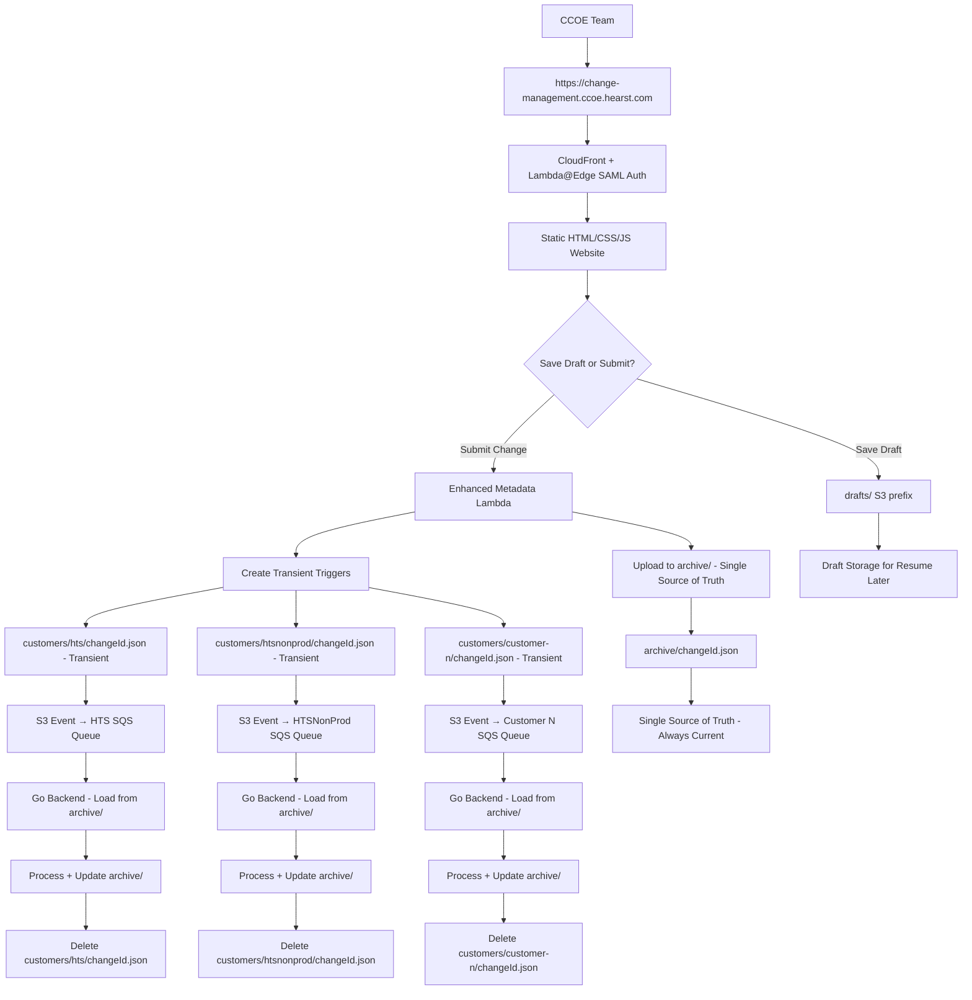

# Multi-Customer Email Distribution Architecture Design

## Overview

This design implements a comprehensive multi-customer email distribution system for the CCOE team at Hearst that supports change management and other notification use cases across ~30 customer AWS Organizations in a Managed Service Provider (MSP) environment. The system enables the CCOE team to use https://change-management.ccoe.hearst.com to write a Change Control request once and select which customer(s) it applies to. The architecture includes a complete web portal with SAML authentication, Lambda-based backend services, S3 event notifications with customer-specific SQS queues, and a comprehensive Go CLI (CCOE Customer Contact Manager) that handles SES email management, SQS message processing, alternate contact management, and Identity Center integration while maintaining proper isolation and security boundaries.

The core business logic flow is: CCOE creates changes → frontend creates JSON → S3 bucket storage → S3 notifications trigger customer-specific SQS queues → Go backend processes SQS events → assumes customer IAM roles → sends templated emails using customer's own SES List Management service based on change status mapping to appropriate topics (aws-approval, aws-announce).

## Architecture

### High-Level Architecture

#### CCOE Change Management System Architecture (Transient Trigger Pattern)



**Key Benefits:**

- **CCOE Workflow Integration**: Single website for all change management with customer selection
- **Draft vs. Submit Logic**: Drafts don't trigger emails, only submitted changes send approval requests
- **Perfect Customer Isolation**: Each customer processes their own changes using their own SES services
- **Role-Based Security**: Go backend assumes customer-specific roles for SES operations
- **SAML Authentication**: Enterprise SSO integration with AWS Identity Center
- **Scalable Architecture**: Direct S3 → SQS → Go backend processing per customer
- **Multi-Topic Workflow**: Automatic notifications sent to appropriate SES topics (aws-announce, aws-approval) based on change status per customer

**Transient Trigger Pattern Benefits:**

- **Single Source of Truth**: `archive/` is the only authoritative location - eliminates data synchronization issues
- **No Duplicate Data**: Backend always reads from `archive/`, never from `customers/` triggers
- **Cleaner S3 Structure**: No long-term clutter in `customers/` prefix - triggers deleted immediately after processing
- **Backend-Driven Updates**: Backend updates `archive/` with meeting metadata and processing results before cleanup
- **Built-in Idempotency**: Duplicate SQS events are safe - backend checks if trigger still exists before processing
- **Simplified Lifecycle Management**: No lifecycle policies needed - backend handles cleanup immediately
- **Cost Optimization**: Minimal storage costs - only one permanent copy per change in `archive/`
- **Prevents Confusion**: Clear separation between operational triggers (`customers/`) and permanent storage (`archive/`)
- **Atomic Processing**: Update archive → delete trigger ensures consistency
- **Safe Retries**: If archive update fails, trigger remains for retry; if delete fails, processing is still complete

### Core Components

#### 1. CCOE Change Management Portal (https://change-management.ccoe.hearst.com)

- **Location**: S3 bucket with static website hosting behind CloudFront with custom domain and auto-renewing SSL certificate
- **Authentication**: Lambda@Edge with AWS IAM Identity Center SAML integration using samlify library
- **Purpose**: Single portal for CCOE team to create change requests and select affected customers
- **Site Structure**:

  ```
  /index.html          - Dashboard with statistics, recent changes, quick actions
  /create-change.html  - Create new change form with multi-customer selection
  /edit-change.html    - Edit existing change (loads by changeId parameter)
  /view-changes.html   - Browse and display existing changes
  /search-changes.html - Search changes by ID, title, customer, etc.
  /my-changes.html     - User's drafts and submitted changes with tabs
  /assets/css/         - Shared CSS styling
  /assets/js/          - Shared JavaScript functionality
  ```

- **Business Logic Implementation**:
  - **Dashboard**: Statistics cards, recent changes, quick action buttons
  - **Create Change**: Multi-customer checkbox selection, draft saving (no emails), submit triggers approval workflow
  - **Draft Management**: Server-side storage in drafts/ S3 prefix, no email notifications
  - **Submit Workflow**: Triggers Enhanced Metadata Lambda → S3 uploads → SQS notifications → status-based emails to appropriate SES topics
  - **My Changes**: Tabbed interface (Drafts, Submitted, All) with filtering and search
  - **Change Lifecycle**: Draft → Submit for Approval → Submitted → Approved → Implemented
- **Authentication Flow**:
  - Lambda@Edge intercepts requests and validates SAML session cookies
  - Redirects to Identity Center for authentication if no valid session
  - Processes SAML responses and creates session cookies
  - Adds user context headers (x-user-email, x-authenticated) for backend Lambda functions
- **Core Features**:
  - SAML authentication with @hearst.com domain validation
  - Multi-customer selection with checkbox grid and select-all/clear-all
  - Draft vs. submit logic with clear separation of email triggering
  - Real-time upload progress tracking with error handling
  - Change ID consistency from draft through submission
  - Comprehensive CRUD operations via Enhanced Metadata Lambda

#### 2. Lambda Backend Services

- **Lambda@Edge SAML Authentication** (`lambda/saml_auth/lambda-edge-samlify.js`):
  - Intercepts CloudFront requests for authentication
  - Handles SAML SSO flow with AWS Identity Center
  - Validates session cookies and user permissions
  - Adds authentication headers for downstream Lambda functions
  - Supports SAML ACS endpoint processing and session management

- **Upload Metadata Lambda** (`lambda/upload_lambda/upload-metadata-lambda.js`):
  - Comprehensive API backend for change management operations
  - Handles upload, CRUD operations, search, and draft management
  - Routes: 
    - `/upload` (POST) - Submit changes and trigger email workflow
    - `/changes` (GET) - Get all changes
    - `/changes/{id}` (GET) - Get specific change
    - `/changes/{id}` (PUT) - Update existing change
    - `/changes/{id}` (DELETE) - Delete change
    - `/changes/{id}/approve` (POST) - Approve change
    - `/changes/{id}/complete` (POST) - Mark change complete
    - `/changes/{id}/versions` (GET) - Get change versions
    - `/changes/search` (POST) - Search changes
    - `/changes/statistics` (GET) - Get dashboard statistics
    - `/changes/recent` (GET) - Get recent changes
    - `/my-changes` (GET) - Get user's changes
    - `/drafts` (GET/POST) - Get/save drafts
    - `/drafts/{id}` (GET/DELETE) - Get/delete specific draft
    - `/auth-check` (GET) - Validate authentication
  - Validates user authentication via Lambda@Edge headers (x-user-email, x-authenticated)
  - Implements change ID consistency (preserves draft IDs on submission)
  - Manages S3 uploads to customer prefixes and archive storage
  - Provides user-specific data filtering and access control
  - Automatically cleans up drafts after submission


#### 3. S3 Event Notifications and Storage Structure

- **S3 Bucket Structure**:
  ```
  4cm-prod-ccoe-change-management-metadata/
  ├── customers/           # Operational files (30-day lifecycle)
  │   ├── hts/            # HTS production customer
  │   ├── htsnonprod/     # HTS non-production customer  
  │   └── {customer}/     # Other customer organizations
  ├── drafts/             # Draft storage
  └── archive/            # Permanent storage for search/edit
  ```

- **Event Notification Configuration**: S3 bucket configured with event notifications ONLY for customer prefixes (customers/{code}/), NOT for drafts/ prefix
- **Trigger Flow**: Direct S3 → SQS integration for each customer prefix (no Lambda router needed)
- **Draft Storage**: drafts/ prefix has NO event notifications and does NOT trigger SQS messages
- **Lifecycle Management**: Automatic cleanup of customers/ prefix after 30 days, permanent archive/ storage

#### 4. Customer-Specific SQS Processing

- **SQS Queues**: One queue per customer organization in the production governance account
- **Message Processing**: Go CLI backend processes SQS messages using `process-sqs-message` action
- **Customer Isolation**: Each customer's queue only receives their own change notifications
- **Message Format**: S3 event notifications containing bucket name and object key
- **Processing Logic**: 
  1. Extract customer code from S3 key path
  2. Download JSON metadata from S3
  3. Assume customer-specific SES role (special handling for htsnonprod → common-nonprod account)
  4. Send to appropriate topic based on change status:
     - Submitted changes → `aws-approval` topic
     - Approved/completed changes → `aws-announce` topic

#### 5. Go CLI Backend (CCOE Customer Contact Manager)

- **Deployment**: Can run as Lambda function or containerized CLI
- **Core Functionality**: SES management, SQS processing, alternate contact management, Identity Center integration
- **Customer Role Assumption**: Uses customer-specific SES role ARNs from config.json
- **Email Processing**: Sends templated emails using customer's own SES contact lists and topics
- **Topic Selection**: Business logic automatically selects appropriate SES topic based on change status:
  - `aws-approval`: For approval requests (submitted changes requiring approval)
  - `aws-announce`: For announcements (approved changes and completed changes)
  - `aws-calendar`: For meeting invites (special Microsoft Graph API processing)
  - Additional topics may be added for enablement opportunities or PAS team communications
  - No emails: For cancelled or rejected changes
- **Meeting Functionality**: Special handling for calendar invites using Microsoft Graph API:
  - Queries `aws-calendar` SES topic from each affected customer
  - Aggregates and deduplicates recipients across all customers
  - Creates unified meeting invite via Microsoft Graph API
  - Bypasses normal SES email workflow for meeting requests
- **Configuration**: Consolidated config.json with customer mappings, SES roles, and SQS queue ARNs
- **CLI and Lambda Modes**: Supports both CLI mode for scheduled operations (list management, Identity Center integration) and Lambda handler mode for SQS event processing
- **Identity Center Integration**: Automatically provisions SES List Management subscriptions based on Identity Center user roles (security, cloudeng, etc.)
- **List Management**: Comprehensive SES contact list operations including create-list, describe-list, delete-list, list-contacts, topic management, and bulk subscribe/unsubscribe operations

**Go CLI Architecture Details:**

```yaml
CLI Mode Operations:
  Contact List Management:
    - create-contact-list: Create new SES contact lists per customer
    - list-contact-lists: List all contact lists for customer
    - describe-contact-list: Show detailed contact list information
    - add-contact: Add email to contact list
    - remove-contact: Remove email from contact list
    - list-contacts: Display all contacts in a list
    - describe-contact: Show detailed contact information
    - add-contact-topics: Add topic subscriptions to contact
    - remove-contact-topics: Remove topic subscriptions from contact
    - remove-all-contacts: Remove all contacts from list (with backup)
    - backup-contact-list: Create backup of contact list

  Topic Management:
    - describe-topic: Show detailed topic information
    - describe-topic-all: Show all topics with statistics
    - send-topic-test: Send test email to topic subscribers
    - update-topic: Update topics from configuration
    - subscribe: Subscribe users based on configuration
    - unsubscribe: Unsubscribe users based on configuration

  Suppression Management:
    - add-to-suppression: Add email to suppression list (bounce/complaint)
    - remove-from-suppression: Remove email from suppression list

  Email & Notifications:
    - send-test-email: Send test email
    - send-general-preferences: Send general preferences email
    - send-approval-request: Send approval request email to topic subscribers
    - send-change-notification: Send change approved/scheduled notification email
    - create-ics-invite: Send calendar invite with ICS attachment
    - create-meeting-invite: Create meeting via Microsoft Graph API (special workflow)

  Meeting Management (Microsoft Graph API):
    - query-calendar-recipients: Query aws-calendar topic from all affected customers
    - aggregate-recipients: Unify and deduplicate recipients across customers
    - create-graph-meeting: Create meeting via Microsoft Graph API with unified recipient list
    - validate-graph-credentials: Validate Microsoft Graph API authentication

  Identity Center Integration:
    - list-identity-center-user: List specific user from Identity Center
    - list-identity-center-user-all: List ALL users from Identity Center
    - list-group-membership: List group memberships for specific user
    - list-group-membership-all: List group memberships for ALL users
    - import-aws-contact: Import specific user to SES based on group memberships
    - import-aws-contact-all: Import ALL users to SES based on group memberships

  Configuration & Validation:
    - validate-customers: Validate customer codes and access
    - extract-customers: Extract customers from metadata
    - configure-s3-events: Configure S3 event notifications
    - test-s3-events: Test S3 event delivery
    - validate-s3-events: Validate S3 event configuration
    - validate-customer: Validate specific customer access

Lambda Handler Mode:
  SQS Event Processing:
    - Automatic Lambda handler for SQS events (AWS_LAMBDA_FUNCTION_NAME environment)
    - ProcessSQSRecord: Main entry point for SQS message processing
    - S3 metadata retrieval: Download JSON objects from S3 using event metadata
    - Customer role assumption: Assume customer-specific SES roles
    - Email sending: Send templated emails using customer's SES service
    - Error handling: Isolated error handling per customer with retry mechanisms
    - Status reporting: Detailed logging and progress tracking

Special Customer Configurations:
  htsnonprod Customer:
    - Uses common-nonprod account for SES operations
    - Special role ARN mapping in config.json
    - Maintains same SQS processing workflow
  
  Standard Customers:
    - Use their own SES-enabled AWS Organization member accounts
    - Customer-specific role ARNs for SES access
    - Independent SQS queues and processing

Common CLI Features:
  - Dry-run mode for all operations
  - Configurable concurrency and rate limiting
  - Comprehensive logging and error handling
  - Cross-account role assumption
  - Configuration file validation
```

## Components and Interfaces

### Backend Processing Logic (Transient Trigger Pattern)

```go
// ProcessS3Event handles S3 events from SQS queue
func ProcessS3Event(event S3Event) error {
    customerCode := extractCustomerCode(event.S3.Object.Key)
    changeId := extractChangeId(event.S3.Object.Key)
    
    // Step 1: Idempotency check - verify trigger still exists
    triggerKey := fmt.Sprintf("customers/%s/%s.json", customerCode, changeId)
    exists, err := s3Client.HeadObject(triggerKey)
    if err != nil || !exists {
        log.Info("Trigger already processed, skipping", "changeId", changeId)
        return nil // Safe to skip - already handled
    }
    
    // Step 2: Load authoritative data from archive
    archiveKey := fmt.Sprintf("archive/%s.json", changeId)
    changeData, err := s3Client.GetObject(archiveKey)
    if err != nil {
        return fmt.Errorf("failed to load from archive: %w", err)
    }
    
    // Step 3: Process the change (send emails, schedule meetings, etc.)
    results, err := processChange(changeData, customerCode)
    if err != nil {
        return fmt.Errorf("failed to process change: %w", err)
    }
    
    // Step 4: Update archive with processing results
    changeData.Modifications = append(changeData.Modifications, ModificationEntry{
        Timestamp: time.Now(),
        UserId: "backend-system",
        ModificationType: "processed",
        CustomerCode: customerCode,
    })
    
    // Add meeting metadata if applicable
    if results.MeetingCreated {
        changeData.Modifications = append(changeData.Modifications, ModificationEntry{
            Timestamp: time.Now(),
            UserId: "backend-system",
            ModificationType: "meeting_scheduled",
            MeetingMetadata: results.MeetingMetadata,
        })
    }
    
    // Step 4: Update archive with processing results
    err = s3Client.PutObject(archiveKey, changeData)
    if err != nil {
        // CRITICAL: Delete trigger but do NOT acknowledge SQS message
        // This allows retry while preventing duplicate triggers
        _ = s3Client.DeleteObject(triggerKey)
        return fmt.Errorf("failed to update archive: %w", err)
    }
    
    // Step 5: Delete trigger (cleanup)
    err = s3Client.DeleteObject(triggerKey)
    if err != nil {
        log.Warn("Failed to delete trigger, but processing complete", "error", err)
        // Non-fatal - processing is complete, archive is updated
    }
    
    // Step 6: Acknowledge SQS message (only after successful archive update)
    log.Info("Successfully processed change", "changeId", changeId, "customer", customerCode)
    return nil
}

// Key Design Principles:
// 1. Always load from archive/ (single source of truth)
// 2. Check trigger existence for idempotency
// 3. Update archive, then delete trigger
// 4. If archive update fails: delete trigger but don't ack SQS (allows retry)
// 5. Trigger deletion failure is non-fatal (processing complete)
// 6. Acknowledge SQS message ONLY after successful archive update
```

### S3 Static Website Interface

```yaml
Site Navigation:
  Header Navigation:
    - Dashboard (Home)
    - Create Change
    - View Changes
    - Search Changes
    - Profile
    - Logout

Page Workflows:

  Dashboard (/index.html):
    1. Display recent changes submitted by user
    2. Show system status and statistics
    3. Quick action buttons for common tasks
    4. Notifications and alerts

  Create Change (/create-change.html):
    1. Fill out change management form (title, customers, schedule, etc.)
    2. Select action type (approval-request, notification, meeting-invite)
    3. Preview generated metadata.json
    4. Click "Generate & Submit" button
    5. JavaScript generates metadata.json and uploads to S3 trigger bucket

  View Changes (/view-changes.html):
    1. Browse paginated list of metadata files from S3 archive
    2. Filter by date range, customer, or change type
    3. Click on any metadata file to view formatted content
    4. Display metadata with syntax highlighting and collapsible sections
    5. Show execution status and customer delivery results

  Search Changes (/search-changes.html):
    1. Advanced search form with multiple filter criteria
    2. Full-text search within metadata content
    3. Date range picker for time-based filtering
    4. Customer and change type multi-select filters
    5. Export search results to CSV or JSON

Authentication & Upload Architecture:

  Identity Center + CloudFront + Lambda@Edge Implementation:
    - CloudFront distribution serves S3 static website content
    - Lambda@Edge function intercepts requests for authentication
    - Identity Center SAML/OIDC integration provides enterprise SSO
    - JWT tokens from Identity Center contain user attributes and permissions
    - Lambda@Edge validates JWT tokens and user permissions
    - Authenticated users receive temporary AWS credentials via STS AssumeRoleWithWebIdentity
    - Direct S3 upload using temporary credentials with customer-specific permissions
    - Complete audit trail of user actions and file uploads
    - Automatic token refresh and session management

Detailed Authentication Workflow:
  1. User accesses CloudFront URL for metadata collector
  2. Lambda@Edge (viewer-request) checks for valid JWT token in cookies
  3. If no token or expired token:
     a. Lambda@Edge redirects to Identity Center login URL
     b. User authenticates with corporate credentials (SSO)
     c. Identity Center returns JWT token with user attributes
     d. Lambda@Edge sets secure HTTP-only cookie with JWT
  4. Lambda@Edge (viewer-request) validates JWT token signature and expiration
  5. Lambda@Edge extracts user permissions from JWT claims
  6. If authorized, request proceeds to S3 static website
  7. JavaScript on page calls Lambda@Edge endpoint to exchange JWT for AWS credentials
  8. Lambda@Edge (origin-request) uses STS AssumeRoleWithWebIdentity
  9. Returns temporary AWS credentials scoped to user's customer permissions
  10. JavaScript uses credentials for direct S3 upload with customer-specific prefix

JavaScript Functions:

  Authentication & Core:
    - checkAuthentication() -> Promise<boolean>
    - redirectToLogin() -> void
    - exchangeTokenForCredentials(jwtToken) -> Promise<AWSCredentials>
    - handleAuthError(error) -> void
    - initializeNavigation() -> void
    - updateUserProfile(userInfo) -> void

  Create Change Page:
    - validateForm() -> boolean
    - generateMetadata() -> JSON
    - previewMetadata(metadata) -> void
    - uploadToS3WithCredentials(metadata, credentials) -> Promise<response>
    - showUploadStatus(status) -> void

  View Changes Page:
    - listMetadataFiles(prefix, pageToken) -> Promise<FileList>
    - loadMetadataFile(s3Key) -> Promise<JSON>
    - displayMetadata(metadata, container) -> void
    - formatMetadataForDisplay(metadata) -> HTML
    - filterFilesByDate(files, startDate, endDate) -> FileList
    - paginateResults(files, pageSize, currentPage) -> PaginatedResults

  Search Changes Page:
    - buildSearchQuery(criteria) -> SearchQuery
    - searchMetadataContent(query) -> Promise<SearchResults>
    - applyFilters(files, filters) -> FilteredResults
    - exportResults(results, format) -> void
    - highlightSearchTerms(content, terms) -> HTML

  Dashboard Page:
    - loadRecentChanges(limit) -> Promise<ChangeList>
    - getSystemStatus() -> Promise<StatusInfo>
    - displayQuickActions(userPermissions) -> void
    - loadNotifications() -> Promise<NotificationList>

Permission Model:
  - ChangeManager Role: Can submit all change types for all customers
  - CustomerManager Role: Can submit changes only for assigned customers
  - ReadOnly Role: Can view form but cannot submit changes
  - Auditor Role: Can access archived metadata for investigation
```

### S3 Event Configuration (No Lambda Router Needed)

```yaml
S3 Bucket Event Notifications:
  customers/customer-a/*:
    - Destination: Customer A SQS Queue
    - Events: s3:ObjectCreated:*
    - Filter: prefix="customers/customer-a/" suffix=".json"
    
  customers/customer-b/*:
    - Destination: Customer B SQS Queue  
    - Events: s3:ObjectCreated:*
    - Filter: prefix="customers/customer-b/" suffix=".json"
    
  customers/customer-n/*:
    - Destination: Customer N SQS Queue
    - Events: s3:ObjectCreated:*
    - Filter: prefix="customers/customer-n/" suffix=".json"
    
  # IMPORTANT: NO event notifications for drafts/ prefix
  # drafts/* - NO SQS notifications (drafts don't trigger emails)

SQS Message Format (from S3 Event):
  Records[0]:
    s3:
      bucket: metadata-trigger-bucket
      object: 
        key: customers/customer-a/change-123.json
        size: 2048
    eventName: ObjectCreated:Put
```

### Web Interface with Change Management Lifecycle

```yaml
Create New Change:
  1. User fills out form with change details
  2. Generate unique changeId (GUID) and set version=1, status="draft"
  3. Save to drafts/{changeId}.json for editing (optional)
  4. User can preview, edit, and save multiple times
  5. When ready, user clicks "Submit Change"
  6. Upload to operational and archive locations
  
Modify Existing Change:
  1. User searches/browses existing changes by changeId or title
  2. Load change from archive/{changeId}.json
  3. Pre-populate form with existing data
  4. User makes modifications
  5. Increment version number, update modifiedAt/modifiedBy
  6. Save updated version to all locations
  7. Send "change updated" notifications to affected customers

Upload Logic (Transient Trigger Pattern):
  Draft Save (NO EMAIL NOTIFICATIONS):
    - Upload to drafts/{changeId}.json (server-side storage only)
    - NO S3 event notifications triggered
    - NO SQS messages generated
    - NO email notifications sent
    
  Submit Change (TRIGGERS EMAIL WORKFLOW):
    Single Customer Change:
      1. Upload to archive/{changeId}.json (single source of truth)
      2. Upload to customers/{customer-code}/{changeId}.json (transient trigger)
      3. Remove from drafts/{changeId}.json (optional cleanup)
      4. Backend processes trigger, updates archive, deletes trigger
      
    Multi-Customer Change:
      1. Upload to archive/{changeId}.json (single source of truth)
      2. Upload to each customers/{customer-code}/{changeId}.json (transient triggers)
      3. Each upload triggers that customer's SQS queue independently
      4. Remove from drafts/{changeId}.json (optional cleanup)
      5. Each backend processes its trigger, updates archive, deletes its trigger

Critical Business Logic:
  - S3 event notifications ONLY configured for customers/{code}/ prefix
  - drafts/ prefix has NO event notifications and generates NO SQS messages
  - archive/ is the single source of truth - always load from here
  - customers/ objects are transient triggers - deleted after processing
  - Backend updates archive/ BEFORE deleting customers/ trigger
  - Idempotency: duplicate events are safe (trigger already deleted)
  - Only submitted changes trigger the email notification workflow
  - Draft changes can be edited indefinitely without sending emails

JavaScript Functions:
  - generateChangeId() -> string (GUID)
  - loadExistingChange(changeId) -> Promise<metadata>
  - loadDraft(changeId) -> Promise<metadata>
  - searchChanges(criteria) -> Promise<changeList>
  - saveAsDraft(metadata) -> Promise<response>
  - submitChange(metadata) -> Promise<results>
  - updateExistingChange(metadata) -> Promise<results>
  - uploadToArchiveAndTriggers(metadata) -> Promise<results>

S3 Storage Structure (Transient Trigger Pattern):
  drafts/{changeId}.json - Working copies for editing (optional)
  customers/{code}/{changeId}.json - Transient triggers (deleted by backend after processing)
  archive/{changeId}.json - Single source of truth (permanent storage)

Upload Sequence:
  1. Upload to archive/{changeId}.json (establish source of truth)
  2. Upload to customers/{code}/{changeId}.json for each customer (create triggers)
  3. Backend processes each trigger independently
  4. Backend updates archive/ with results (meeting metadata, etc.)
  5. Backend deletes customers/{code}/{changeId}.json (cleanup trigger)
```

### Customer Process Interface

```yaml
Standard Email Processing (Transient Trigger Pattern):
  Input:
    - S3 event from SQS containing:
      - bucket: metadata-trigger-bucket
      - object_key: customers/{customer-code}/{changeId}.json
      - event_name: ObjectCreated:Put

  Processing:
    1. Check if trigger still exists (idempotency check):
       - HEAD request to customers/{customer-code}/{changeId}.json
       - If not found, skip processing (already handled)
    
    2. Load authoritative data from archive:
       - GET archive/{changeId}.json
       - Parse change metadata
    
    3. Execute email workflow:
       - Assume customer-specific SES role
       - Send emails based on change status
       - Log delivery status
    
    4. Update archive with results:
       - Add modification entry with processing timestamp
       - Update meeting metadata if applicable
       - PUT archive/{changeId}.json
    
    5. Delete trigger (cleanup):
       - DELETE customers/{customer-code}/{changeId}.json
       - Confirms processing complete

  Output:
    - Email delivery via customer's SES
    - Updated archive with processing metadata
    - Trigger object deleted from customers/ prefix

  Error Handling:
    - If archive update fails: Delete trigger but do NOT acknowledge SQS message (allows retry)
    - If trigger delete fails: Log warning (safe to ignore - processing complete)
    - If duplicate event received: Skip processing (trigger already deleted)
    - SQS message acknowledged ONLY after successful archive update

Meeting Invite Processing (Special Workflow):
  Input:
    - S3 event from SQS for change with meeting request
    - Change metadata containing meeting details
    - List of affected customer codes

  Processing:
    1. Check if trigger still exists (idempotency check)
    
    2. Load authoritative data from archive/{changeId}.json
    
    3. For each affected customer:
       - Assume customer-specific SES role
       - Query aws-calendar topic subscribers
       - Extract email addresses from topic
    
    4. Aggregate recipients:
       - Combine all customer recipient lists
       - Deduplicate email addresses
       - Validate email format
    
    5. Microsoft Graph API integration:
       - Authenticate with Microsoft Graph API
       - Create meeting with unified recipient list (idempotency key: changeId)
       - Set meeting details from change metadata
       - Send calendar invites via Graph API
    
    6. Update archive with meeting metadata:
       - Add modification entry with meeting_scheduled type
       - Store meeting_id, join_url, start_time, end_time
       - PUT archive/{changeId}.json
    
    7. Delete trigger (cleanup):
       - DELETE customers/{customer-code}/{changeId}.json

  Output:
    - Meeting created in Microsoft 365/Outlook
    - Calendar invites sent to all unified recipients
    - Archive updated with meeting metadata
    - Trigger object deleted from customers/ prefix
    - No SES email processing for meeting requests

  Idempotency:
    - Meeting creation uses changeId as idempotency key
    - Duplicate events safely skip if trigger already deleted
    - Graph API prevents duplicate meetings with same key
```

## Data Models

### Enhanced Metadata Format with Change ID

```json
{
  "changeId": "550e8400-e29b-41d4-a716-446655440000",
  "version": 1,
  "createdAt": "2025-09-20T15:30:00Z",
  "modifiedAt": "2025-09-20T15:30:00Z",
  "createdBy": "user@company.com",
  "modifiedBy": "user@company.com",
  "status": "draft|submitted|approved|completed|cancelled",
  "changeMetadata": {
    "title": "Configure Proof-of-Value exercise with FinOut",
    "customerNames": ["Customer A", "Customer B"],
    "customerCodes": ["customer-a", "customer-b"],
    "tickets": {
      "serviceNow": "CHG0123456",
      "jira": "INFRA-2847"
    },
    "schedule": {
      "implementationStart": "2025-09-20T10:00",
      "implementationEnd": "2025-09-20T17:00",
      "beginDate": "2025-09-20",
      "beginTime": "10:00",
      "endDate": "2025-09-20",
      "endTime": "17:00",
      "timezone": "America/New_York"
    },
    "changeReason": "Evaluate new cost management platform",
    "implementationPlan": "Deploy FinOut platform in test environment",
    "testPlan": "Validate cost data ingestion and reporting",
    "expectedCustomerImpact": "No customer impact expected",
    "rollbackPlan": "Remove FinOut configuration if issues arise"
  },
  "emailNotification": {
    "subject": "CCOE Change: Configure Proof-of-Value exercise"
  },
  "meetingInvite": {
    "title": "Change Implementation Meeting",
    "startTime": "2025-09-20T10:00",
    "duration": 420,
    "location": "Microsoft Teams"
  }
}
```

### S3 Storage Structure (Transient Trigger Pattern)

```
s3://metadata-trigger-bucket/
├── customers/ (transient trigger mechanism - deleted by backend after processing)
│   ├── customer-a/
│   │   └── changeId.json (triggers SQS, deleted after backend processes)
│   ├── customer-b/
│   │   └── changeId.json (triggers SQS, deleted after backend processes)
├── drafts/ (server-side draft storage)
│   ├── changeId-abc123.json (working copy for editing)
│   └── changeId-def456.json (working copy for editing)
└── archive/ (single source of truth - permanent storage)
    └── changeId.json (authoritative copy, updated by backend with meeting metadata)
```

**Transient Trigger Pattern Benefits:**
- **Single Source of Truth**: `archive/` is the only authoritative copy
- **No Duplicate Data**: Eliminates synchronization issues between `customers/` and `archive/`
- **Cleaner S3 Structure**: No long-term clutter in `customers/` prefix
- **Backend-Driven Updates**: Backend updates `archive/` with meeting metadata before deleting trigger
- **Idempotent Processing**: Duplicate events are safe - backend checks if already processed
- **Cost Optimization**: No lifecycle policies needed - immediate cleanup after processing

**Upload and Processing Flow:**

- **Frontend Upload (Submit Change)**:
  1. Upload to `archive/{changeId}.json` (single source of truth)
  2. Upload to each `customers/{customer-code}/{changeId}.json` (triggers SQS events)
  
- **Backend Processing (Per Customer)**:
  1. Receive S3 event from SQS queue
  2. Load change from `archive/{changeId}.json` (authoritative source)
  3. Process event (send emails, schedule meetings, etc.)
  4. Update `archive/{changeId}.json` with any changes (e.g., meeting metadata)
  5. Delete `customers/{customer-code}/{changeId}.json` (cleanup trigger)
  
- **Idempotency Guarantees**:
  - Backend checks if `customers/{customer-code}/{changeId}.json` still exists before processing
  - If already deleted, skip processing (duplicate event)
  - All operations are safe to retry
  - Meeting scheduling uses idempotency keys to prevent duplicates

**Critical Implementation Details:**

- **Update Before Delete**: Backend MUST update `archive/` before deleting `customers/` object
- **Atomic Operations**: Use S3 conditional operations where possible
- **Error Handling**: If update fails, do not delete trigger (allows retry)
- **Audit Trail**: All modifications tracked in `archive/` object's modification array
- **No Lifecycle Policies**: `customers/` objects deleted immediately by backend, not by lifecycle rules

## Infrastructure as Code (Terraform)

### Required Terraform Modules

#### 1. Central Infrastructure (Management Account)

```hcl
# S3 Bucket for metadata storage and static website
module "metadata_bucket" {
  source = "./modules/s3-metadata-bucket"
  
  bucket_name = "multi-customer-change-metadata"
  lifecycle_rules = {
    customers_prefix_deletion = {
      prefix = "customers/"
      expiration_days = 30
    }
  }
  event_notifications = var.customer_sqs_queues
  cors_configuration = true
  static_website_hosting = true
}

# CloudFront distribution for static website
module "cloudfront_distribution" {
  source = "./modules/cloudfront-identity-center"
  
  s3_bucket_domain = module.metadata_bucket.website_endpoint
  identity_center_domain = var.identity_center_domain
  lambda_edge_functions = {
    viewer_request = module.lambda_edge_auth.viewer_request_arn
    origin_request = module.lambda_edge_auth.origin_request_arn
  }
}

# Lambda@Edge for Identity Center authentication
module "lambda_edge_auth" {
  source = "./modules/lambda-edge-auth"
  
  identity_center_issuer = var.identity_center_issuer
  jwt_signing_key = var.identity_center_jwt_key
  customer_permissions = var.customer_access_mappings
}

# IAM roles for user access
module "user_access_roles" {
  source = "./modules/iam-user-roles"
  
  identity_center_provider_arn = var.identity_center_provider_arn
  customer_mappings = var.customer_access_mappings
  s3_bucket_arn = module.metadata_bucket.bucket_arn
}
```

#### 2. Customer Infrastructure (SQS Queues in Production Governance Account)

```hcl
# SQS queue for change notifications (in production governance account)
module "change_notification_queue" {
  source = "./modules/sqs-change-queue"
  
  customer_code = var.customer_code
  dead_letter_queue_enabled = true
  visibility_timeout = 900  # 15 minutes for processing
  message_retention_period = 1209600  # 14 days
}

# ECS service for processing changes
module "change_processor_ecs" {
  source = "./modules/ecs-change-processor"
  
  customer_code = var.customer_code
  sqs_queue_arn = module.change_notification_queue.queue_arn
  container_image = var.aws_alternate_contact_manager_image
  task_cpu = 256
  task_memory = 512
  auto_scaling = {
    min_capacity = 0
    max_capacity = 5
    target_cpu_utilization = 70
  }
}

# CloudWatch monitoring and alarms
module "monitoring" {
  source = "./modules/cloudwatch-monitoring"
  
  customer_code = var.customer_code
  sqs_queue_name = module.change_notification_queue.queue_name
  ecs_service_name = module.change_processor_ecs.service_name
  alert_sns_topic = var.alert_sns_topic
}
```

#### 3. Cross-Account Permissions for Customer SES Access

```hcl
# IAM role for Go CLI to assume customer SES roles
resource "aws_iam_role" "customer_ses_access_role" {
  name = "customer-${var.customer_code}-ses-access"
  
  assume_role_policy = jsonencode({
    Statement = [{
      Effect = "Allow"
      Principal = {
        AWS = var.governance_account_role_arn
      }
      Action = "sts:AssumeRole"
    }]
  })
}

# S3 event notification to customer SQS (in governance account)
resource "aws_s3_bucket_notification" "customer_notifications" {
  bucket = var.central_metadata_bucket_id
  
  queue {
    queue_arn = module.change_notification_queue.queue_arn
    events = ["s3:ObjectCreated:*"]
    filter_prefix = "customers/${var.customer_code}/"
    filter_suffix = ".json"
  }
}
```

### Terraform Directory Structure

```
terraform/
├── environments/
│   ├── dev/
│   │   ├── main.tf
│   │   ├── variables.tf
│   │   └── terraform.tfvars
│   ├── staging/
│   └── production/
├── modules/
│   ├── s3-metadata-bucket/
│   │   ├── main.tf
│   │   ├── variables.tf
│   │   └── outputs.tf
│   ├── cloudfront-identity-center/
│   ├── lambda-edge-auth/
│   ├── iam-user-roles/
│   ├── sqs-change-queue/
│   ├── ecs-change-processor/
│   └── cloudwatch-monitoring/
├── governance-account/
│   ├── sqs-queues/
│   │   ├── main.tf
│   │   ├── variables.tf
│   │   └── terraform.tfvars
│   └── go-cli-processing/
├── customer-ses-roles/
│   ├── customer-a/
│   │   ├── main.tf
│   │   ├── variables.tf
│   │   └── terraform.tfvars
│   ├── customer-b/
│   └── customer-n/
└── scripts/
    ├── deploy-all-customers.sh
    ├── onboard-new-customer.sh
    └── validate-infrastructure.sh
```

### Key Terraform Features Required

#### 1. Multi-Account Deployment
- **Central Account**: S3, CloudFront, Lambda@Edge, IAM roles
- **Production Governance Account**: SQS queues, Go CLI processing, CloudWatch monitoring
- **Customer Accounts**: SES services only (accessed via cross-account roles)
- **Cross-Account Permissions**: S3 → SQS event notifications, Go CLI → Customer SES access

#### 2. Environment Management
- **Dev/Staging/Production**: Separate Terraform workspaces
- **Customer Isolation**: Separate state files per customer
- **Variable Management**: Customer-specific configurations

#### 3. Automation Scripts
- **Customer Onboarding**: Automated infrastructure provisioning
- **Bulk Deployment**: Deploy to all customers simultaneously
- **Infrastructure Validation**: Automated testing of cross-account connectivity

#### 4. State Management
- **Remote State**: S3 backend with DynamoDB locking
- **State Isolation**: Separate state per customer and environment
- **State Security**: Encrypted state files with proper IAM access

## Error Handling

### Failure Scenarios and Responses

1. **Customer SQS Queue Unavailable**
   - Retry with exponential backoff
   - Alert operations team after threshold
   - Continue processing other customers

2. **Customer ECS Task Failure**
   - SQS message returns to queue for retry
   - Dead letter queue after max retries
   - Customer-specific alerting

3. **Metadata Storage Failure**
   - Retry metadata upload
   - Fail fast if metadata cannot be stored
   - No customer processes triggered without metadata

4. **Partial Customer Failures**
   - Track per-customer success/failure
   - Allow successful customers to complete
   - Retry only failed customers

### Monitoring and Alerting

- **CloudWatch Metrics**: Queue depths, task execution times, failure rates
- **CloudWatch Alarms**: High failure rates, stuck messages, long processing times
- **Customer-Specific Dashboards**: Per-customer email delivery status
- **Central Dashboard**: Overall system health and execution tracking

## Testing Strategy

### Unit Testing

- Distribution orchestrator logic
- Message formatting and parsing
- Customer code extraction from metadata
- Error handling scenarios

### Integration Testing

- End-to-end message flow from metadata to email delivery
- Cross-account SQS message delivery
- S3 metadata access from customer accounts
- ECS task triggering and execution

### Load Testing

- Concurrent change processing
- High customer count scenarios
- SQS queue performance under load
- S3 metadata access patterns

### Disaster Recovery Testing

- Customer account unavailability
- Central component failures
- Metadata storage failures
- Network partition scenarios

## Implementation Approaches

### Option 1: SQS-Based Triggering (Recommended)

**Pros:**

- Native AWS service with high reliability
- Built-in retry and dead letter queue capabilities
- Natural customer isolation
- Cost-effective for intermittent workloads
- Easy to monitor and troubleshoot

**Cons:**

- Requires cross-account SQS permissions
- Additional infrastructure per customer
- Message size limitations (256KB)

**Implementation:**

1. Create SQS queue in each customer organization
2. Grant central orchestrator permission to send messages
3. Configure ECS service to poll SQS queue
4. Use CloudWatch Events to trigger ECS tasks on message arrival

### Option 2: EventBridge-Based Triggering

**Pros:**

- Event-driven architecture
- Built-in filtering and routing
- Schema registry support
- Integration with multiple targets

**Cons:**

- More complex setup and configuration
- Higher cost for high-volume scenarios
- Requires careful event schema management

### Option 3: Lambda-Based Orchestration

**Pros:**

- Serverless execution model
- Automatic scaling
- Pay-per-execution pricing
- Easy integration with other AWS services

**Cons:**

- 15-minute execution time limit
- Cold start latency
- More complex state management for long-running processes

### Option 4: Step Functions Workflow

**Pros:**

- Visual workflow management
- Built-in error handling and retry logic
- State management capabilities
- Integration with multiple AWS services

**Cons:**

- Higher complexity for simple triggering
- Additional cost for workflow executions
- Learning curve for workflow definition

## Recommended Solution: SQS-Based Architecture

Based on the requirements analysis, **Option 1 (SQS-Based Triggering)** is recommended because:

1. **Simplicity**: Leverages existing CLI with minimal changes
2. **Reliability**: SQS provides built-in retry and error handling
3. **Isolation**: Natural customer boundaries through separate queues
4. **Cost-Effectiveness**: Pay only for messages processed
5. **Monitoring**: Rich CloudWatch integration
6. **Scalability**: Handles varying customer counts and change frequencies

### Implementation Phases

**Phase 1: Core Infrastructure**

- Create SQS queues in customer organizations
- Implement distribution orchestrator
- Set up S3 metadata storage
- Basic monitoring and alerting

**Phase 2: Enhanced Features**

- Dead letter queue handling
- Execution tracking and status reporting
- Customer-specific dashboards
- Advanced error handling

**Phase 3: Optimization**

- Performance tuning
- Cost optimization
- Advanced monitoring
- Disaster recovery procedures
