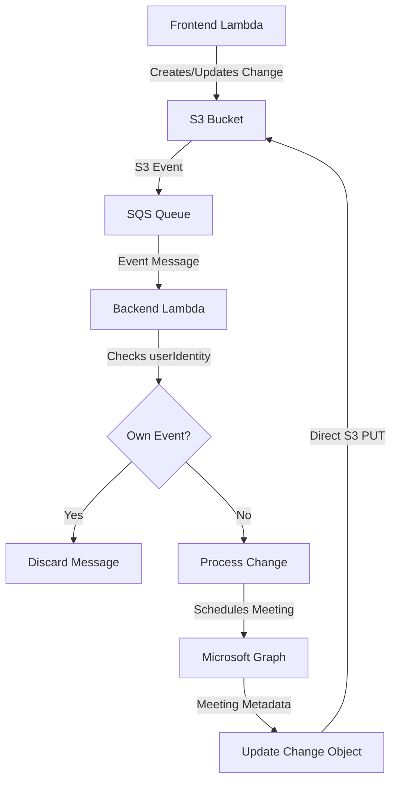

# Design Document

## Overview

This design document outlines the technical approach for enhancing the JSON object model used by the change management system. The enhancement replaces simple string fields for modifications and approvals with array-based tracking, adds Microsoft Graph meeting metadata integration, and establishes efficient backend-to-S3 update mechanisms while preventing infinite event loops.

The design focuses on maintaining system performance while adding comprehensive audit capabilities and meeting lifecycle management.

## Architecture

### High-Level Data Flow



### Component Interactions

1. **Frontend Lambda**: Creates and updates change objects with modification tracking
2. **S3 Bucket**: Stores change objects with enhanced modification arrays
3. **SQS Queue**: Delivers S3 events to backend with userIdentity information
4. **Backend Lambda**: Processes events, manages meetings, updates objects
5. **Microsoft Graph**: Provides meeting scheduling and management services

## Components and Interfaces

### Enhanced Change Object Structure

```json
{
  "id": "change-12345",
  "title": "Database Migration",
  "description": "Migrate production database to new schema",
  "status": "submitted",
  "customers": ["customer1", "customer2"],
  
  "modifications": [
    {
      "timestamp": "2025-01-15T10:30:00Z",
      "user_id": "user123",
      "modification_type": "created"
    },
    {
      "timestamp": "2025-01-15T11:00:00Z", 
      "user_id": "user456",
      "modification_type": "updated"
    },
    {
      "timestamp": "2025-01-15T14:30:00Z",
      "user_id": "approver789", 
      "modification_type": "approved"
    },
    {
      "timestamp": "2025-01-15T15:00:00Z",
      "user_id": "backend-system",
      "modification_type": "meeting_scheduled",
      "meeting_metadata": {
        "meeting_id": "AAMkAGVmMDEzMTM4LTZmYWUtNDdkNC1hMDZiLTU1OGY5OTZhYmY4OABGAAAAAAAiQ8W967B7TKBjgx9rVEURBwAiIsqMbYjsT5e-T8KzowKTAAAAAAENAAAiIsqMbYjsT5e-T8KzowKTAAABRbD1AAA=",
        "join_url": "https://teams.microsoft.com/l/meetup-join/...",
        "start_time": "2025-01-20T14:00:00Z",
        "end_time": "2025-01-20T15:00:00Z",
        "subject": "Change Review Meeting - Database Migration"
      }
    }
  ],
  
  "implementation_plan": "...",
  "rollback_plan": "...",
  "schedule": "..."
}
```

### Modification Entry Interface

```typescript
interface ModificationEntry {
  timestamp: string;        // ISO 8601 format
  user_id: string;         // Identity Center user ID
  modification_type: 'created' | 'updated' | 'submitted' | 'approved' | 'deleted' | 'meeting_scheduled' | 'meeting_cancelled';
  meeting_metadata?: MeetingMetadata;  // Only for meeting-related types
}

interface MeetingMetadata {
  meeting_id: string;
  join_url: string;
  start_time: string;
  end_time: string;
  subject: string;
  organizer?: string;
  attendees?: string[];
}
```

### S3 Event Processing Interface

```typescript
interface S3EventRecord {
  eventSource: string;
  eventName: string;
  userIdentity: {
    type: string;
    principalId: string;
    arn: string;
  };
  s3: {
    bucket: { name: string };
    object: { key: string };
  };
}

interface SQSMessage {
  Records: S3EventRecord[];
}
```

## Data Models

### Change Object Evolution

**Before (Legacy Format):**
```json
{
  "lastModified": "2025-01-15T10:30:00Z by user123",
  "approvedBy": "approver789 on 2025-01-15T14:30:00Z"
}
```

**After (Enhanced Format):**
```json
{
  "modifications": [
    {
      "timestamp": "2025-01-15T10:30:00Z",
      "user_id": "user123", 
      "modification_type": "created"
    },
    {
      "timestamp": "2025-01-15T14:30:00Z",
      "user_id": "approver789",
      "modification_type": "approved"
    }
  ]
}
```

### Meeting Metadata Storage

Meeting information is embedded within modification entries of type `meeting_scheduled`:

```json
{
  "timestamp": "2025-01-15T15:00:00Z",
  "user_id": "backend-system",
  "modification_type": "meeting_scheduled",
  "meeting_metadata": {
    "meeting_id": "graph-meeting-id-12345",
    "join_url": "https://teams.microsoft.com/l/meetup-join/...",
    "start_time": "2025-01-20T14:00:00Z",
    "end_time": "2025-01-20T15:00:00Z",
    "subject": "Change Review Meeting - Database Migration"
  }
}
```

### Event Loop Prevention Data

The backend uses the `userIdentity` field from S3 events to identify event sources:

```json
{
  "userIdentity": {
    "type": "AssumedRole",
    "principalId": "AIDACKCEVSQ6C2EXAMPLE:backend-lambda-function", 
    "arn": "arn:aws:sts::123456789012:assumed-role/backend-lambda-role/backend-lambda-function"
  }
}
```

## Error Handling

### S3 Update Failures

**Retry Strategy:**
- Exponential backoff: 1s, 2s, 4s, 8s, 16s
- Maximum 5 retry attempts
- Log detailed error information
- Continue processing other events

**Concurrent Update Handling:**
- Use S3 versioning for conflict detection
- Implement conditional updates with ETag validation
- Retry with fresh object retrieval on version conflicts

### Meeting API Failures

**Microsoft Graph Error Handling:**
- Retry transient errors (5xx, rate limiting)
- Log permanent errors (4xx) without retry
- Add modification entry indicating failure
- Continue processing without blocking workflow

**Meeting Idempotency Failures:**
- If existing meeting cannot be updated, create new meeting
- Update stored metadata with new meeting information
- Log the fallback operation for audit purposes

### Event Processing Failures

**Malformed Events:**
- Log warning for missing userIdentity
- Process event normally to avoid missing legitimate changes
- Monitor logs for patterns indicating system issues

**SQS Message Handling:**
- Use SQS dead letter queues for persistent failures
- Implement message visibility timeout for processing time
- Log processing decisions for debugging

## Testing Strategy

### Unit Testing

**Modification Array Logic:**
- Test array initialization for new changes
- Verify proper appending of modification entries
- Validate modification type handling
- Test timestamp and user_id formatting

**Event Loop Prevention:**
- Test userIdentity extraction from S3 events
- Verify correct identification of backend vs frontend events
- Test edge cases with malformed or missing userIdentity
- Validate logging of discard decisions

**Meeting Metadata Integration:**
- Test meeting metadata structure validation
- Verify proper embedding in modification entries
- Test meeting idempotency logic
- Validate meeting cancellation handling

### Integration Testing

**End-to-End Workflow:**
1. Frontend creates change → Verify modification array initialization
2. Backend processes event → Verify userIdentity check
3. Backend schedules meeting → Verify metadata storage
4. Backend updates S3 → Verify event loop prevention
5. Frontend displays change → Verify modification history

**S3 Event Flow:**
- Test S3 event generation with correct userIdentity
- Verify SQS message delivery and processing
- Test backend event identification and discard
- Validate frontend event processing

**Meeting Lifecycle:**
- Test meeting creation and metadata storage
- Verify meeting updates with existing metadata
- Test meeting cancellation on change deletion
- Validate error handling for meeting API failures

### Performance Testing

**Array Growth Impact:**
- Test performance with large modification arrays (100+ entries)
- Measure S3 object size growth over time
- Validate frontend rendering performance with many modifications
- Test pagination and filtering performance

**Event Processing Efficiency:**
- Measure userIdentity check performance
- Test SQS message processing throughput
- Validate S3 update performance with concurrent operations
- Monitor Lambda execution time and memory usage

### Security Testing

**Access Control:**
- Verify IAM permissions for S3 updates
- Test userIdentity validation security
- Validate meeting metadata access controls
- Test modification entry tampering prevention

**Data Integrity:**
- Test concurrent modification handling
- Verify S3 versioning conflict resolution
- Validate modification array consistency
- Test recovery from partial failures