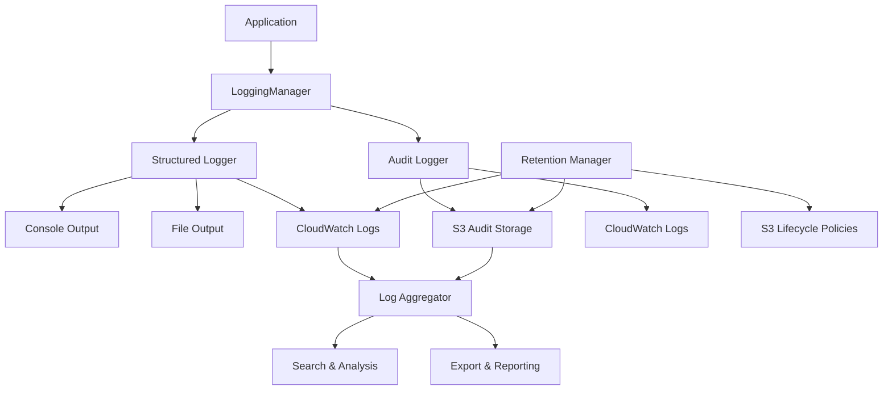

# Comprehensive Logging and Audit Trail System

## Overview

The email distribution system includes a comprehensive logging and audit trail system that provides:

- **Structured Logging**: JSON-formatted logs with consistent fields across all components
- **Audit Trail**: Compliance-ready audit logs for all customer operations and user actions
- **Log Aggregation**: Centralized log collection from multiple customer environments
- **Log Analysis**: Search, filter, and analyze logs across all sources
- **Retention Management**: Automated log retention and archival based on compliance requirements
- **Security Monitoring**: Detailed security event logging and monitoring

## Architecture

### Components

1. **Logger**: Core structured logging with multiple output formats
2. **AuditLogger**: Compliance-focused audit trail logging
3. **LogAggregator**: Cross-customer log aggregation and search
4. **RetentionManager**: Automated log retention and lifecycle management
5. **LoggingManager**: Unified interface for all logging operations

### Data Flow



## Configuration

### Environment Variables

```bash
# Logging Configuration
LOG_LEVEL=info                                    # debug, info, warn, error, audit
CLOUDWATCH_LOG_GROUP=/aws/email-distribution     # CloudWatch log group
LOG_S3_BUCKET=email-distribution-logs            # S3 bucket for log storage
AWS_REGION=us-east-1                             # AWS region

# Audit Configuration
ENABLE_AUDIT=true                                # Enable audit logging
AUDIT_S3_BUCKET=email-distribution-audit        # S3 bucket for audit logs
AUDIT_RETENTION_YEARS=7                          # Audit log retention period

# Retention Configuration
ENABLE_RETENTION=true                            # Enable retention management
RETENTION_CHECK_INTERVAL=24h                    # How often to check retention
```

### Application Configuration

```go
// Initialize logging in main application
config := logging.LoggingConfig{
    Service:         "email-distribution",
    Version:         "1.0.0",
    LogLevel:        logging.INFO,
    CloudWatchGroup: "/aws/email-distribution",
    S3Bucket:        "email-distribution-logs",
    AWSRegion:       "us-east-1",
    CustomerCodes:   []string{"customer-a", "customer-b"},
    EnableAudit:     true,
    EnableRetention: true,
}

loggingManager, err := logging.InitializeLogging(config)
```

## Usage Examples

### Basic Structured Logging

```go
// Initialize logger with customer context
customerLogger := loggingManager.Logger.WithCustomer("customer-a")

// Log operations with structured fields
customerLogger.Info("Processing email distribution", map[string]interface{}{
    "operation":     "send_emails",
    "email_count":   150,
    "template_type": "change_notification",
})

// Log errors with context
customerLogger.Error("Failed to send emails", err, map[string]interface{}{
    "operation":   "send_emails",
    "customer":    "customer-a",
    "error_code":  "SES_THROTTLED",
})
```

### Audit Logging

```go
// Log user actions
loggingManager.LogUserAction(
    "user@company.com",           // User ID
    "create_change_notification", // Action
    "metadata",                   // Resource
    startTime,                    // Start time
    nil,                         // Error (nil for success)
    map[string]interface{}{      // Additional details
        "change_id":      "change-123",
        "customer_count": 3,
        "notification_type": "approval_request",
    },
)

// Log customer operations
loggingManager.LogCustomerOperation(
    "customer-a",                // Customer code
    "update_contacts",           // Operation
    "alternate_contacts",        // Resource
    startTime,                   // Start time
    nil,                        // Error
    map[string]interface{}{     // Details
        "contacts_updated": 3,
        "contact_types": []string{"security", "billing", "operations"},
    },
)

// Log security events
loggingManager.LogSecurityEvent(
    "AUTHENTICATION_FAILURE",   // Event type
    "user@company.com",         // User ID
    "login_attempt",            // Action
    "192.168.1.100",           // IP address
    "Mozilla/5.0...",          // User agent
    authError,                 // Error
    map[string]interface{}{    // Details
        "login_method": "saml",
        "failure_reason": "invalid_credentials",
    },
)
```

### Log Search and Analysis

```go
// Search logs with criteria
criteria := logging.SearchCriteria{
    StartTime:     time.Now().Add(-24 * time.Hour),
    EndTime:       time.Now(),
    CustomerCodes: []string{"customer-a", "customer-b"},
    LogLevels:     []logging.LogLevel{logging.ERROR, logging.WARN},
    Keywords:      []string{"email", "failure"},
    Limit:         100,
}

result, err := loggingManager.SearchLogs(ctx, criteria)
if err != nil {
    log.Fatalf("Search failed: %v", err)
}

fmt.Printf("Found %d log entries\n", result.Total)
for _, entry := range result.Entries {
    fmt.Printf("[%s] %s: %s\n", 
        entry.Timestamp.Format("2006-01-02 15:04:05"),
        entry.Level,
        entry.Message)
}
```

### Log Statistics

```go
// Get log statistics
stats, err := loggingManager.GetLogStatistics(ctx, criteria)
if err != nil {
    log.Fatalf("Failed to get statistics: %v", err)
}

fmt.Printf("Total entries: %d\n", stats.TotalEntries)
fmt.Printf("Error count: %d\n", stats.LevelCounts[logging.ERROR])
fmt.Printf("Top customer: %s (%d entries)\n", 
    getTopCustomer(stats.CustomerCounts))
```

### Log Export

```go
// Export logs to CSV
csvData, err := loggingManager.ExportLogs(ctx, criteria, "csv")
if err != nil {
    log.Fatalf("Export failed: %v", err)
}

err = os.WriteFile("logs_export.csv", csvData, 0644)
if err != nil {
    log.Fatalf("Failed to write file: %v", err)
}
```

## CLI Tool Usage

The system includes a CLI tool for log management:

### Search Logs

```bash
# Search for errors in the last hour
./log-manager -command=search -errors-only \
  -start-time="2024-01-15T10:00:00Z" \
  -limit=50

# Search specific customer logs
./log-manager -command=search \
  -customers="customer-a,customer-b" \
  -keywords="email,failure" \
  -levels="ERROR,WARN"
```

### Get Statistics

```bash
# Get overall statistics
./log-manager -command=stats \
  -start-time="2024-01-15T00:00:00Z" \
  -end-time="2024-01-15T23:59:59Z"

# Get customer-specific statistics
./log-manager -command=stats \
  -customers="customer-a" \
  -levels="ERROR"
```

### Export Logs

```bash
# Export to CSV
./log-manager -command=export \
  -format=csv \
  -output=logs.csv \
  -start-time="2024-01-15T00:00:00Z" \
  -customers="customer-a"

# Export audit logs
./log-manager -command=export \
  -audit-only \
  -format=json \
  -output=audit.json
```

### Manage Retention

```bash
# Apply retention policies
./log-manager -command=retention -apply-policies

# Show retention status
./log-manager -command=retention -show-status
```

### View Audit Trail

```bash
# View audit trail for specific customer
./log-manager -command=audit \
  -customers="customer-a" \
  -start-time="2024-01-15T00:00:00Z"
```

## Log Formats

### Structured Log Entry

```json
{
  "timestamp": "2024-01-15T14:30:45.123Z",
  "level": "INFO",
  "message": "Email distribution completed successfully",
  "service": "email-distribution",
  "version": "1.0.0",
  "customer_code": "customer-a",
  "execution_id": "exec-123456",
  "user_id": "user@company.com",
  "operation": "send_emails",
  "component": "email_manager",
  "trace_id": "trace-789",
  "span_id": "span-456",
  "fields": {
    "email_count": 150,
    "template_type": "change_notification",
    "duration_ms": 2500,
    "ses_message_id": "0000014a-f4d4-4f89-9c3e-5c5c5c5c5c5c"
  },
  "caller": {
    "file": "email.go",
    "function": "SendEmails",
    "line": 245
  }
}
```

### Audit Event

```json
{
  "event_id": "audit-1642258245123-1642258245",
  "timestamp": "2024-01-15T14:30:45.123Z",
  "event_type": "CUSTOMER_OPERATION",
  "user_id": "user@company.com",
  "customer_code": "customer-a",
  "resource": "alternate_contacts",
  "action": "update_contacts",
  "result": "SUCCESS",
  "details": {
    "contacts_updated": 3,
    "contact_types": ["security", "billing", "operations"],
    "duration_ms": 1250
  },
  "ip_address": "192.168.1.100",
  "user_agent": "Mozilla/5.0 (Windows NT 10.0; Win64; x64) AppleWebKit/537.36",
  "session_id": "session-abc123",
  "trace_id": "trace-789"
}
```

## Retention Policies

### Default Policies

The system includes default retention policies for compliance:

#### Audit Logs (7 Years)
- **Retention**: 7 years (SOX compliance)
- **Storage**: S3 Glacier after 90 days
- **Deletion**: Never (compliance requirement)
- **Log Groups**: `/aws/email-distribution/audit`

#### Security Logs (3 Years)
- **Retention**: 3 years (PCI compliance)
- **Storage**: S3 Glacier after 30 days
- **Deletion**: Never
- **Log Groups**: `/aws/email-distribution/security`

#### Operational Logs (90 Days)
- **Retention**: 90 days
- **Storage**: S3 IA after 30 days
- **Deletion**: After 90 days
- **Log Groups**: `/aws/email-distribution/app`

#### Debug Logs (7 Days)
- **Retention**: 7 days
- **Storage**: S3 Standard
- **Deletion**: After 7 days
- **Log Groups**: `/aws/email-distribution/debug`

### Custom Policies

```go
// Define custom retention policy
policy := logging.RetentionPolicy{
    Name:              "customer-specific-logs",
    LogGroups:         []string{"/aws/email-distribution/customer-a"},
    CustomerCodes:     []string{"customer-a"},
    RetentionPeriod:   365 * 24 * time.Hour, // 1 year
    ArchivalPeriod:    30 * 24 * time.Hour,  // Archive after 30 days
    ComplianceLevel:   "HIPAA",
    ArchivalStorage:   "S3_GLACIER",
    DeleteAfterExpiry: false,
}
```

## Compliance Features

### SOX Compliance
- **Audit Trail**: Complete audit trail for all financial operations
- **Retention**: 7-year retention for audit logs
- **Immutability**: Audit logs stored in immutable S3 storage
- **Access Control**: Strict access controls on audit data

### PCI Compliance
- **Security Logging**: All security events logged and monitored
- **Retention**: 3-year retention for security logs
- **Encryption**: All logs encrypted in transit and at rest
- **Access Monitoring**: All access to logs is audited

### HIPAA Compliance
- **Data Access Logging**: All access to customer data logged
- **Retention**: Configurable retention based on requirements
- **Encryption**: End-to-end encryption of all log data
- **Access Controls**: Role-based access to log data

## Monitoring and Alerting

### CloudWatch Metrics

The logging system emits custom metrics:

- `email_distribution_log_entries_total`: Total log entries by level and customer
- `email_distribution_audit_events_total`: Total audit events by type
- `email_distribution_log_errors_total`: Total log errors by type
- `email_distribution_retention_policy_executions`: Retention policy executions

### Alerts

Key alerts configured in the monitoring system:

- **High Error Rate**: Alert when error rate exceeds 5%
- **Audit Log Failures**: Alert on any audit log storage failures
- **Retention Policy Failures**: Alert on retention policy execution failures
- **Log Storage Issues**: Alert on CloudWatch or S3 storage issues

## Security Considerations

### Data Protection
- **Encryption**: All logs encrypted with AES-256
- **Access Control**: IAM-based access control for all log resources
- **Network Security**: VPC endpoints for secure AWS service access
- **Data Masking**: Sensitive data automatically masked in logs

### Access Auditing
- **Log Access**: All access to logs is audited
- **User Tracking**: Complete user action tracking
- **Permission Changes**: All permission changes audited
- **Data Export**: All log exports tracked and audited

### Compliance Monitoring
- **Policy Enforcement**: Automated enforcement of retention policies
- **Compliance Reporting**: Regular compliance reports generated
- **Audit Trails**: Complete audit trails for compliance reviews
- **Data Integrity**: Checksums and integrity verification for audit logs

## Troubleshooting

### Common Issues

#### Logs Not Appearing in CloudWatch
1. Check IAM permissions for CloudWatch Logs
2. Verify log group exists and is correctly named
3. Check network connectivity to CloudWatch
4. Review application logs for CloudWatch errors

#### Audit Logs Not Stored in S3
1. Verify S3 bucket permissions
2. Check S3 bucket policy and IAM roles
3. Review network connectivity to S3
4. Check for S3 service limits

#### High Log Volume Issues
1. Review log levels and reduce if necessary
2. Implement log sampling for high-volume operations
3. Use buffered outputs to reduce I/O overhead
4. Consider log aggregation at the source

#### Retention Policy Not Applied
1. Check IAM permissions for retention operations
2. Verify retention policy configuration
3. Review CloudWatch Logs retention settings
4. Check S3 lifecycle policy configuration

### Performance Optimization

#### Reduce Log Volume
- Use appropriate log levels (avoid DEBUG in production)
- Implement log sampling for high-frequency operations
- Use structured logging to reduce redundant information
- Filter logs at the source when possible

#### Improve Search Performance
- Use time-based filtering to reduce search scope
- Index frequently searched fields
- Use CloudWatch Insights for complex queries
- Consider log aggregation tools for large-scale analysis

#### Optimize Storage Costs
- Use appropriate S3 storage classes for different log types
- Implement lifecycle policies for automatic transitions
- Compress logs before storage
- Use log retention policies to manage storage growth

## Best Practices

### Logging Guidelines
1. **Use Structured Logging**: Always use JSON format with consistent fields
2. **Include Context**: Add relevant context fields to all log entries
3. **Log at Appropriate Levels**: Use DEBUG for development, INFO for operations
4. **Avoid Sensitive Data**: Never log passwords, tokens, or PII
5. **Use Correlation IDs**: Include trace/correlation IDs for request tracking

### Audit Guidelines
1. **Log All User Actions**: Every user action should be audited
2. **Include Sufficient Detail**: Audit logs should be self-explanatory
3. **Use Consistent Format**: Maintain consistent audit event structure
4. **Protect Audit Integrity**: Ensure audit logs cannot be modified
5. **Regular Review**: Regularly review audit logs for anomalies

### Performance Guidelines
1. **Use Asynchronous Logging**: Don't block operations for logging
2. **Buffer Log Outputs**: Use buffered outputs for high-volume logging
3. **Monitor Log Performance**: Track logging overhead and optimize
4. **Use Sampling**: Sample high-frequency logs when appropriate
5. **Optimize Queries**: Use efficient search patterns and filters