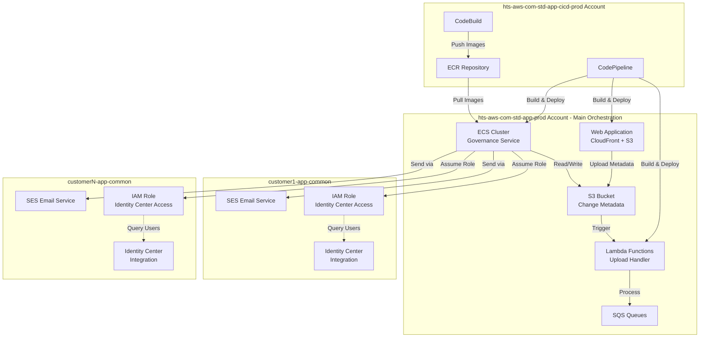
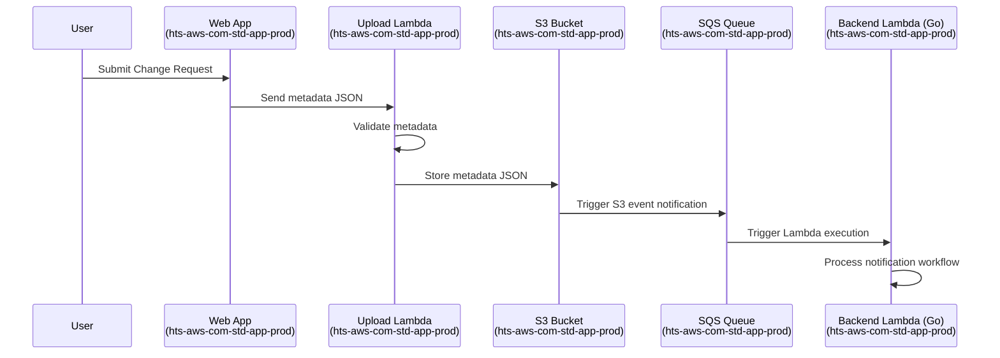
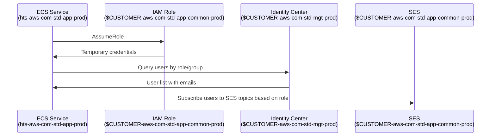
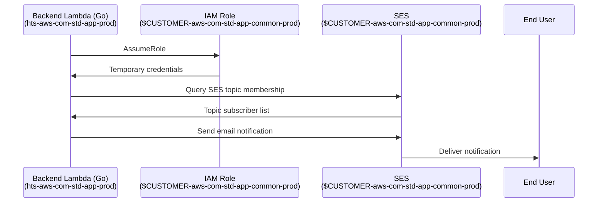

# Solution Overview and Deployment Guide

## Overview

This document provides a comprehensive overview of the multi-account AWS solution architecture, deployment strategy, and account responsibilities for the Customer Contact Manager system.

## Architecture Summary

The solution is deployed across multiple AWS accounts with distinct responsibilities:

- **hts-aws-com-std-app-prod** (Account ID: 730335533660): Main orchestration account hosting the web application, S3 storage, and governance ECS cluster
- **hts-aws-com-std-app-cicd-prod** (Account ID: 173748160886): CI/CD account containing build pipelines for all solution components
- **$CUSTOMER-aws-com-std-app-common-prod (per customer)**: Customer-specific accounts for SES email delivery and IAM role management
- **$CUSTOMER-aws-com-std-mgt-prod (per customer)**: Customer-specific management accounts containing Identity Center for user directory access

## Account Architecture



## Account Details

### hts-aws-com-std-app-prod (Main Orchestration Account)

**Account ID**: 730335533660

**Purpose**: Central orchestration and hosting for the entire solution

**Components**:
- **Web Application**: CloudFront distribution serving static website from S3
- **S3 Bucket**: Stores change request metadata and attachments
- **ECS Cluster**: Runs the governance service container for processing workflows
- **Lambda Functions**: Handles S3 upload events and metadata processing
- **SQS Queues**: Message queuing for asynchronous processing
- **IAM Roles**: Cross-account assume role permissions to access customer accounts

**Key Responsibilities**:
- Host user-facing web interface
- Store all change request data
- Orchestrate workflow processing
- Coordinate cross-account operations
- Aggregate data from multiple customer accounts

### hts-aws-com-std-app-cicd-prod (CI/CD Account)

**Account ID**: 173748160886

**Purpose**: Build and deployment automation

**Components**:
- **CodePipeline**: Orchestrates the build and deployment process
- **CodeBuild**: Compiles Go applications, builds Docker images, packages Lambda functions
- **ECR Repository**: Stores Docker images for ECS deployment
- **S3 Buckets**: Stores build artifacts and deployment packages
- **IAM Roles**: Cross-account deployment permissions

**Key Responsibilities**:
- Build Go backend services
- Build and package Lambda functions
- Create Docker images for ECS
- Deploy infrastructure via Terraform
- Deploy application code to hts-aws-com-std-app-prod
- Manage deployment pipelines

### $CUSTOMER-aws-com-std-app-common-prod Accounts (Per Customer)

**Naming Pattern**: `$CUSTOMER-aws-com-std-app-common-prod` (where $CUSTOMER is the customer identifier)

**Purpose**: Customer-specific email delivery and identity management

**Components**:
- **SES (Simple Email Service)**: Sends emails to customer users
- **IAM Role**: Allows hts-aws-com-std-app-prod to assume role for operations
- **IAM Policy**: Grants permissions for Identity Center queries and SES operations
- **Identity Center Integration**: Access to customer's user directory

**Key Responsibilities**:
- Send notification emails to customer users
- Provide Identity Center user lookup capabilities
- Maintain customer-specific email templates and configurations
- Enforce customer-specific email sending policies

**IAM Role Name**: `hts-ccoe-customer-contact-manager`

**IAM Role Trust Policy** (allows orchestration account):

```json
{
  "Version": "2012-10-17",
  "Statement": [
    {
      "Effect": "Allow",
      "Principal": {
        "AWS": [
          "arn:aws:iam::730335533660:root"
        ]
      },
      "Action": "sts:AssumeRole",
      "Condition": {}
    }
  ]
}
```

**IAM Role Permissions** (minimum required):

```json
{
  "Version": "2012-10-17",
  "Statement": [
    {
      "Sid": "OrganizationsAccess",
      "Effect": "Allow",
      "Action": [
        "organizations:DescribeOrganization",
        "organizations:ListAccounts",
        "organizations:ListAccountsForParent",
        "organizations:ListOrganizationalUnitsForParent",
        "organizations:ListRoots"
      ],
      "Resource": "*"
    },
    {
      "Sid": "SESAccess",
      "Effect": "Allow",
      "Action": [
        "ses:*"
      ],
      "Resource": "*"
    },
    {
      "Sid": "IdentityCenterAccess",
      "Effect": "Allow",
      "Action": [
        "sso-directory:ListUsers",
        "sso-directory:DescribeUser",
        "sso-directory:ListGroups",
        "sso-directory:DescribeGroup",
        "sso-directory:ListGroupsForMember"
      ],
      "Resource": "*"
    }
  ]
}
```

## Data Flow

### Change Request Notification Flow



### Automatic SES Topic Subscription Flow



### Email Notification Flow



## Security Considerations

### Cross-Account Access

- All cross-account access uses IAM role assumption with explicit trust policies
- Temporary credentials are used for all operations
- Least privilege principle applied to all IAM policies
- Regular audit of cross-account permissions

### Data Protection

- All data at rest encrypted using AWS KMS
- All data in transit uses TLS 1.2+
- S3 buckets have versioning enabled
- S3 buckets have access logging enabled

### Network Security

- ECS tasks run in private subnets
- Security groups restrict traffic to necessary ports only
- VPC endpoints used for AWS service access
- CloudFront provides DDoS protection for web application

## Operational Procedures

### Adding a New Customer

1. Deploy $CUSTOMER-aws-com-std-app-common-prod resources in customer account using Terraform
2. Configure SES domain verification
3. Set up Identity Center integration
4. Update orchestration account with customer account ID
5. Test email delivery and Identity Center queries
6. Update application configuration with customer details

### Updating Application Code

1. Commit code changes to GitHub
2. CI/CD pipeline automatically triggers
3. CodeBuild compiles and tests code
4. Artifacts deployed to hts-aws-com-std-app-prod
5. ECS service performs rolling update
6. Monitor CloudWatch logs for errors

### Troubleshooting

**ECS tasks failing to start**:
- Check CloudWatch logs for error messages
- Verify IAM role permissions
- Confirm ECR image exists and is accessible

**Email delivery failures**:
- Verify SES domain verification status
- Check IAM role assumption is working
- Review SES sending limits and quotas
- Check CloudWatch logs for SES API errors

**Cross-account access issues**:
- Verify IAM role trust policy
- Confirm role ARN in application configuration
- Check temporary credential expiration
- Review CloudTrail logs for AssumeRole calls

## Disaster Recovery

### Backup Strategy

- S3 bucket versioning enabled for all metadata
- Daily snapshots of configuration data
- Terraform state stored in S3 with versioning
- Regular exports of SES templates and configurations

### Recovery Procedures

1. Restore Terraform state from backup
2. Re-apply Terraform configuration
3. Restore S3 bucket data from versioned objects
4. Redeploy application code from CI/CD pipeline
5. Verify cross-account connectivity
6. Test email delivery functionality

## Appendix

### Account IDs Reference

| Account Name | Account ID | Purpose |
|--------------|------------|---------|
| hts-aws-com-std-app-prod | `730335533660` | Main orchestration |
| hts-aws-com-std-app-cicd-prod | `173748160886` | CI/CD pipelines |
| hts-nonprod-aws-com-std-app-common-prod | `869445953789` | HTS Non-Prod customer services |
| hts-aws-com-std-app-common-prod | `748906912469` | HTS customer services |
| cds-aws-com-std-app-common-prod | `292011262127` | CDS customer services |
| fdbus-aws-com-std-app-common-prod | `268851382408` | FDBUS customer services |
| hmit-aws-com-std-app-common-prod | `986290841057` | HMIT customer services |
| hmes-aws-com-std-app-common-prod | `861862159782` | HMES customer services |
| htvdigital-aws-com-std-app-common-prod | `903663690255` | HTV Digital customer services |
| htv-aws-com-std-app-common-prod | `697828271549` | HTV customer services |
| icx-aws-com-std-app-common-prod | `855236644817` | ICX customer services |
| motor-aws-com-std-app-common-prod | `313285717748` | Motor customer services |
| bringatrailer-aws-com-std-app-common-prod | `902735874460` | Bring a Trailer customer services |
| mhk-aws-com-std-app-common-prod | `560772587879` | MHK customer services |
| hdmautos-aws-com-std-app-common-prod | `569004526156` | HDM Autos customer services |
| hnpit-aws-com-std-app-common-prod | `950472726311` | HNP IT customer services |
| hnpdigital-aws-com-std-app-common-prod | `133018215083` | HNP Digital customer services |
| campsystems-aws-com-std-app-common-prod | `316298797786` | Camp Systems customer services |
| mcg-aws-com-std-app-common-prod | `374209041829` | MCG customer services |
| hmuk-aws-com-std-app-common-prod | `984327931159` | HMUK customer services |
| hmusdigital-aws-com-std-app-common-prod | `725351846445` | HMUS Digital customer services |
| hre-aws-com-std-app-common-prod | `507528375659` | HRE customer services |
| zynx-aws-com-std-app-common-prod | `263170435941` | Zynx customer services |
| hchb-aws-com-std-app-common-prod | `201998345776` | HCHB customer services |
| fdbuk-aws-com-std-app-common-prod | `580023154652` | FDBUK customer services |
| blkbook-aws-com-std-app-common-prod | `211343842624` | Black Book customer services |
| hecom-aws-com-std-app-common-prod | `345424807017` | HECOM customer services |

### Useful Commands

```bash
# Check ECS service status
aws ecs describe-services --cluster governance-cluster --services governance-service

# View Lambda logs
aws logs tail /aws/lambda/upload-handler --follow

# List S3 bucket contents
aws s3 ls s3://change-metadata-bucket/ --recursive

# Assume role in customer account
aws sts assume-role --role-arn arn:aws:iam::<account-id>:role/governance-access --role-session-name test

# Send test email via SES
aws ses send-email --from sender@example.com --to recipient@example.com --subject "Test" --text "Test message"
```

---

**Document Version**: 1.0  
**Last Updated**: 2025-10-15  
**Maintained By**: Platform Team
