# Transient Trigger Pattern - Architecture Diagrams

## Overview

This document provides visual representations of the Transient Trigger Pattern architecture, processing flows, and operational patterns.

## High-Level Architecture

### System Overview

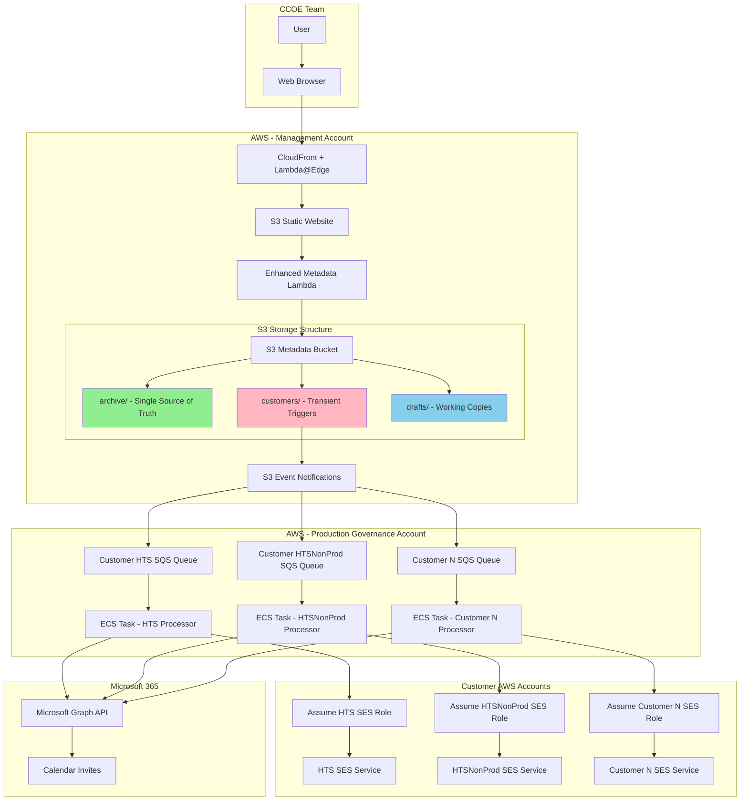

## Storage Architecture

### Transient Trigger Pattern

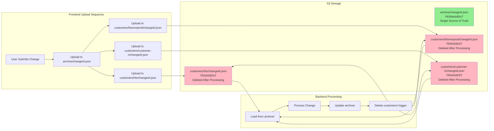

### Storage Lifecycle

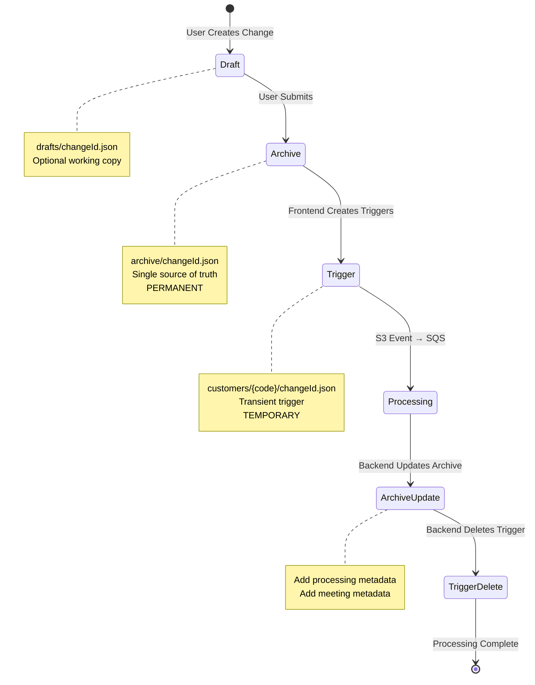

## Processing Flows

### Standard Email Processing Flow

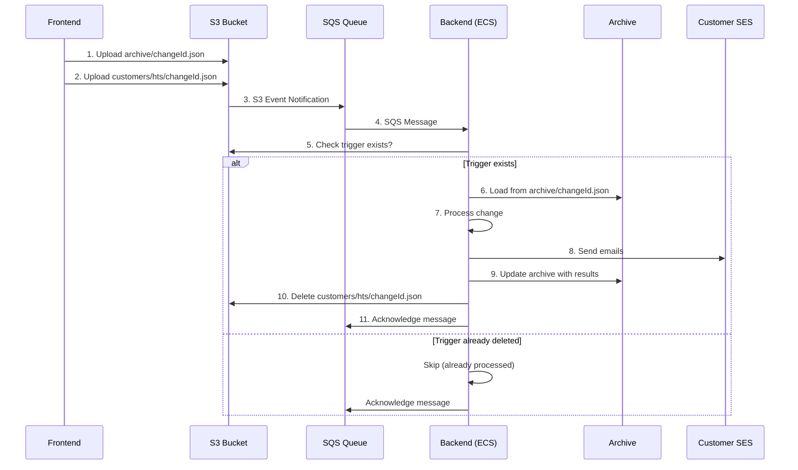

### Meeting Invite Processing Flow

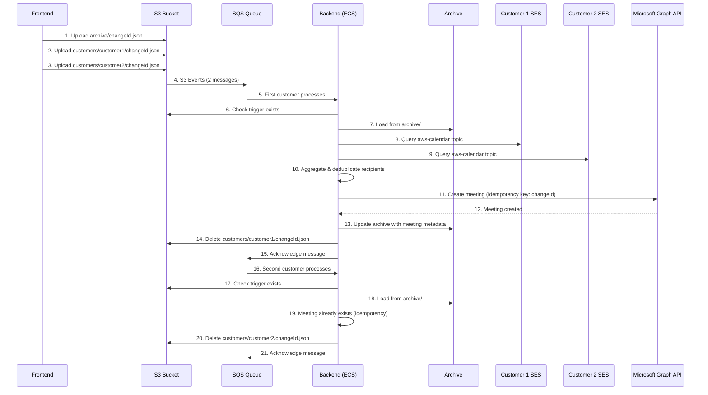

### Idempotency Flow

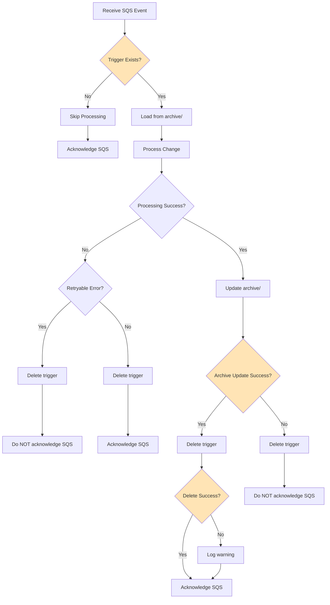

## Error Handling Patterns

### Archive Update Failure

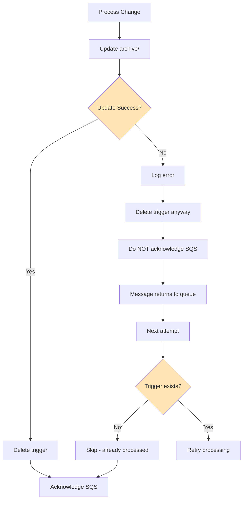

### Trigger Delete Failure

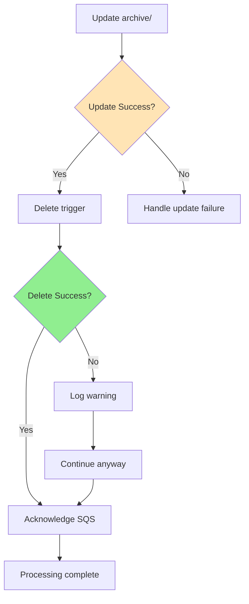

### Duplicate Event Handling

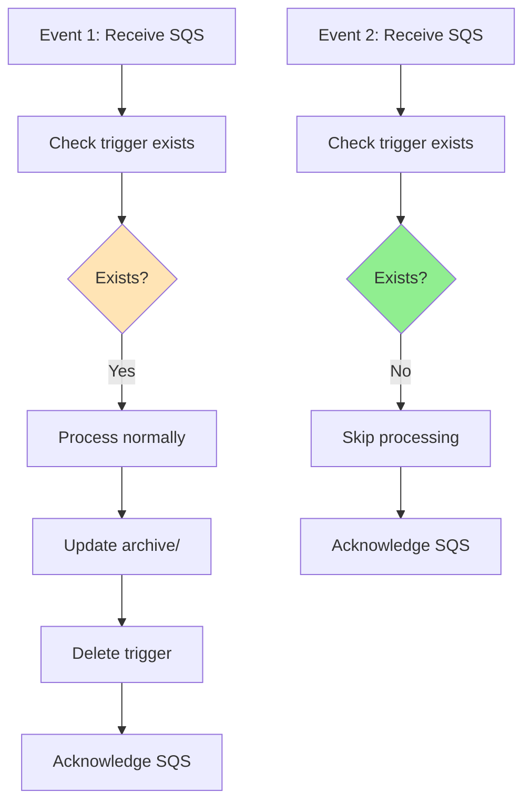

## Data Flow Diagrams

### Archive-First Loading Pattern

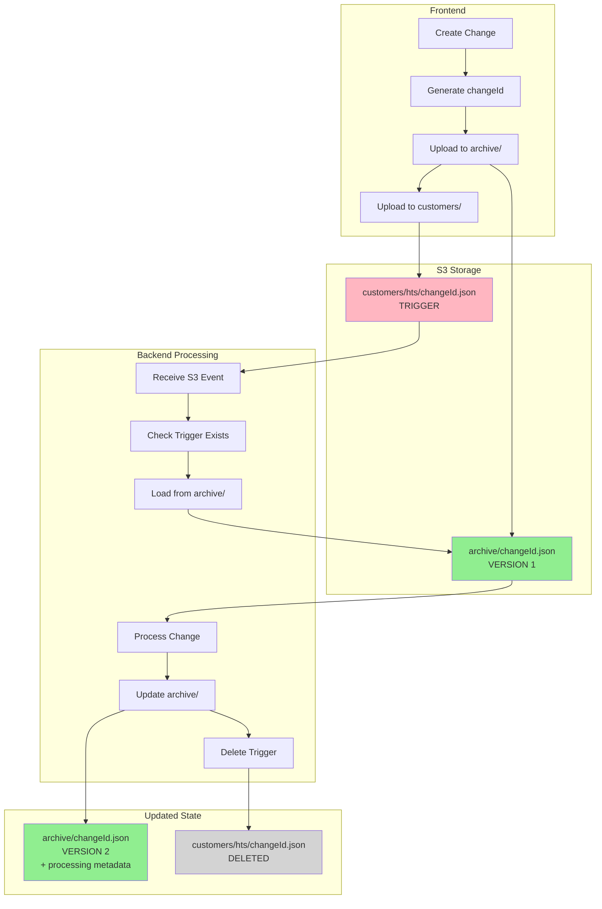

### Modification Array Evolution

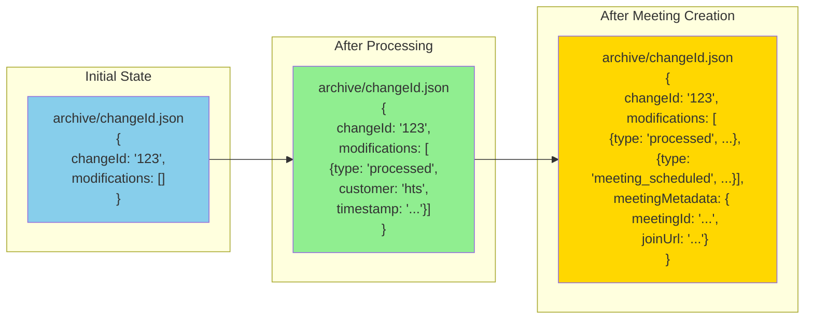

## Monitoring and Observability

### Key Metrics Dashboard

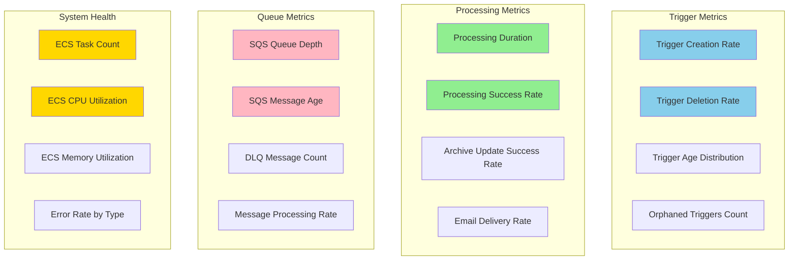

### Alert Thresholds

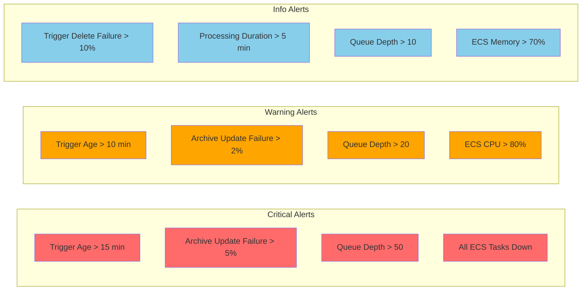

## Customer Isolation

### Multi-Customer Processing

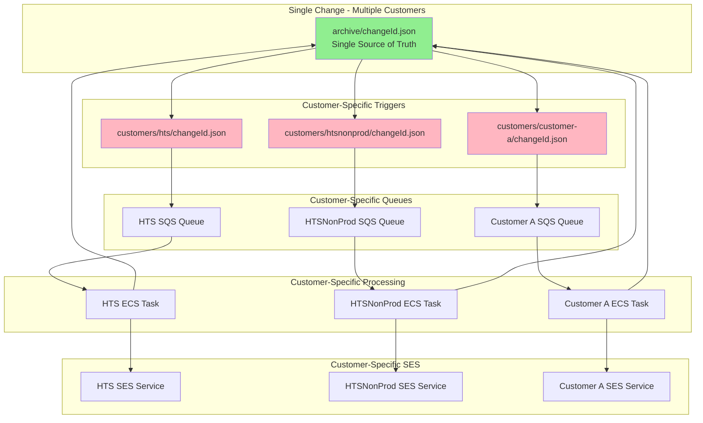

## Deployment Architecture

### Infrastructure Components

```mermaid
graph TB
    subgraph "Management Account"
        A[S3 Metadata Bucket]
        B[CloudFront Distribution]
        C[Lambda@Edge Auth]
        D[Enhanced Metadata Lambda]
    end
    
    subgraph "Production Governance Account"
        E[SQS Queues x N]
        F[ECS Cluster]
        G[CloudWatch Logs]
        H[CloudWatch Metrics]
    end
    
    subgraph "Customer Accounts x N"
        I[SES Service]
        J[IAM Role for Backend]
    end
    
    subgraph "External Services"
        K[AWS Identity Center]
        L[Microsoft Graph API]
    end
    
    B --> A
    C --> B
    D --> A
    A --> E
    E --> F
    F --> G
    F --> H
    F --> J
    J --> I
    C --> K
    F --> L
    
    style A fill:#90EE90
    style E fill:#FFB6C1
    style F fill:#87CEEB
    style I fill:#FFD700
```

## Comparison: Old vs New Pattern

### Old Pattern (Version-Based)

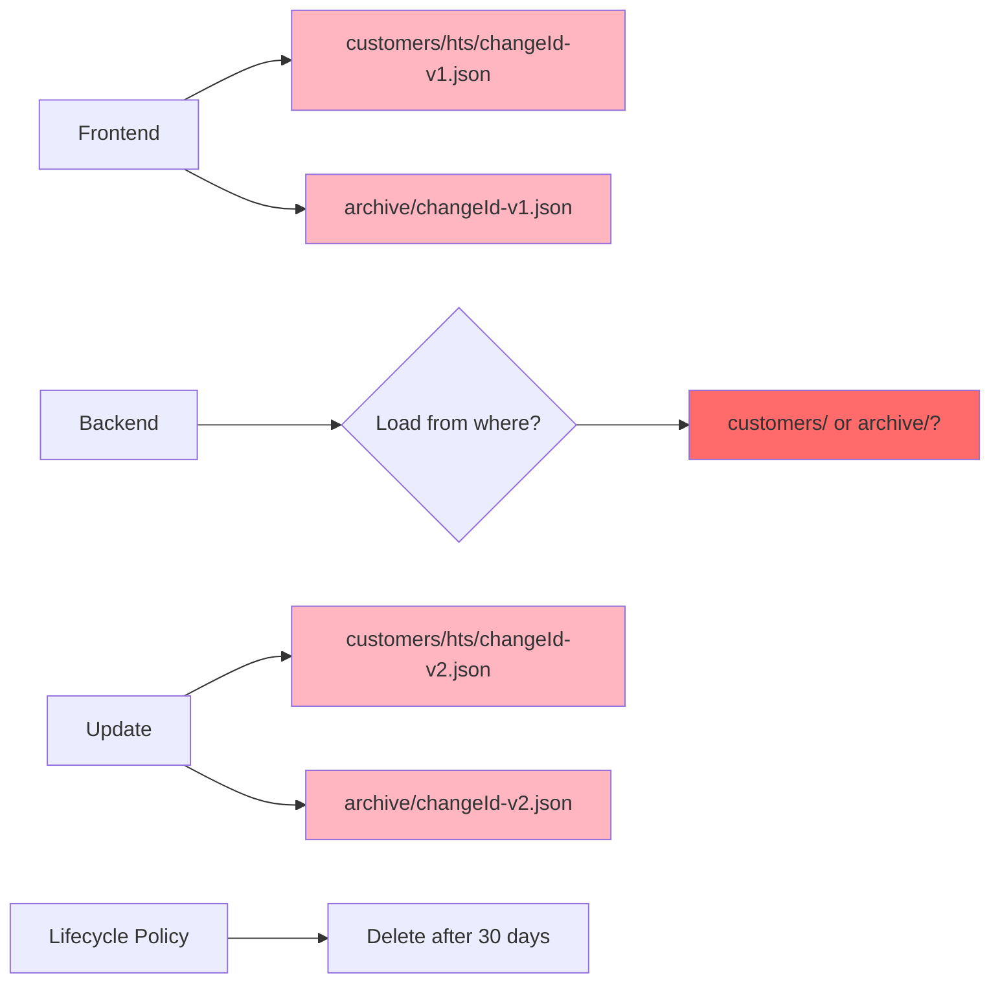

### New Pattern (Transient Trigger)

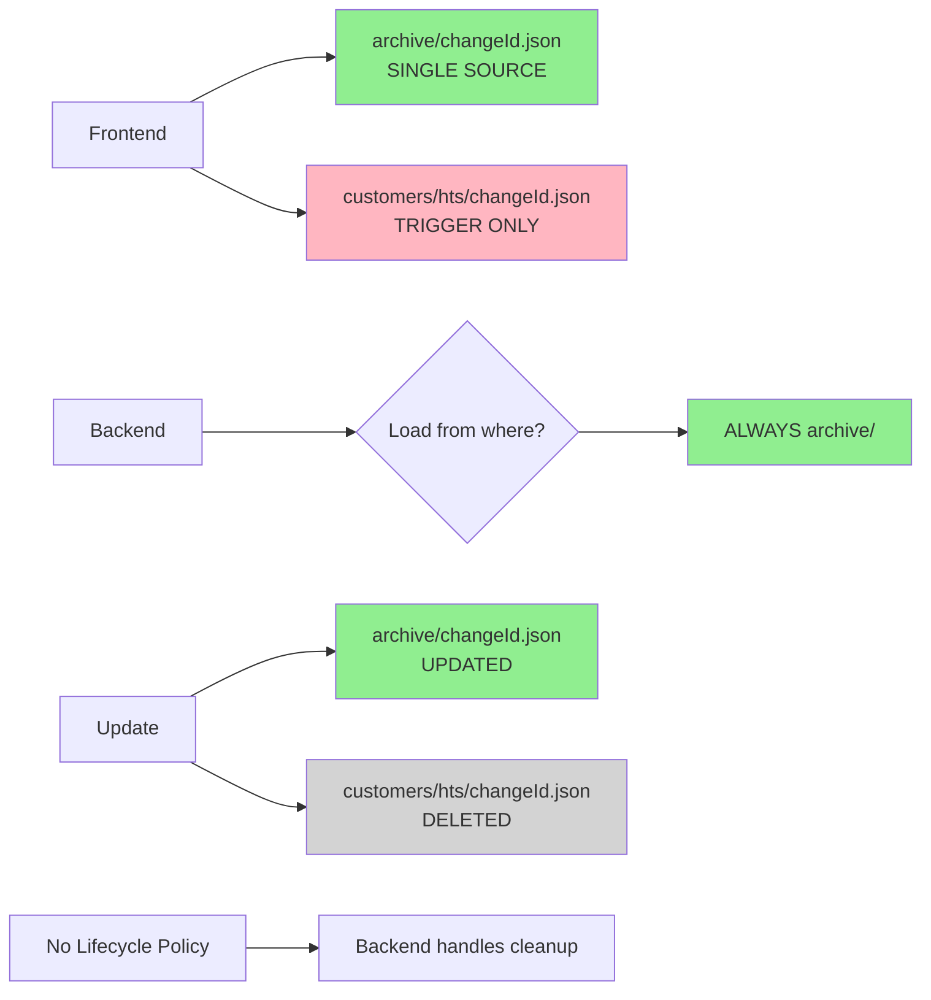

## Related Documentation

- [Architecture Overview](./TRANSIENT_TRIGGER_PATTERN.md)
- [Operational Runbook](./TRANSIENT_TRIGGER_RUNBOOK.md)
- [Troubleshooting Guide](./TRANSIENT_TRIGGER_TROUBLESHOOTING.md)
- [FAQ](./TRANSIENT_TRIGGER_FAQ.md)
