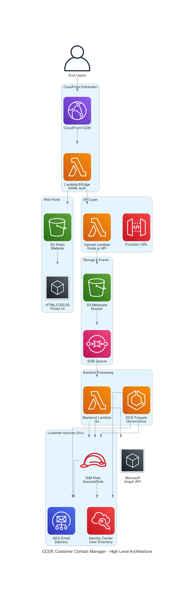

# CCOE Customer Contact Manager - Project Status Summary

**Generated:** October 22, 2025  
**Version:** 1.0.0

## Executive Summary

The CCOE Customer Contact Manager is a comprehensive multi-customer change management and notification system built on AWS. The solution enables centralized management of change requests, announcements, and automated email notifications across 25+ customer organizations using AWS SES, Lambda, S3, and Identity Center integration.

## Architecture Overview



### Four Main Components

1. **SAML Authentication Lambda@Edge** (`./lambda/saml_auth`)
   - CloudFront Lambda@Edge function for SAML SSO authentication
   - Integrates with AWS Identity Center
   - Manages user sessions via secure cookies
   - CloudWatch logs: (Edge locations - multiple regions)

2. **Frontend API Lambda** (`./lambda/upload_lambda`)
   - Node.js Lambda with Function URL
   - Handles metadata uploads, change management, and API endpoints
   - Processes S3 events via SQS
   - CloudWatch logs: `/aws/lambda/hts-ccoe-prod-ccoe-customer-contact-manager-api`

3. **Web Portal UI** (`./html`)
   - Multi-page React-like SPA with vanilla JavaScript
   - Deployed to S3, served via CloudFront
   - Pages: Dashboard, Create Change, My Changes, Approvals, Announcements, Search
   - Creates S3 object events for backend processing

4. **Backend Golang Lambda** (`./main.go` and `./internal/`)
   - Processes S3 events via SQS
   - Sends emails via customer-specific SES
   - Schedules Microsoft Teams meetings
   - Imports contacts from Identity Center
   - CloudWatch logs: `/aws/lambda/hts-ccoe-prod-ccoe-customer-contact-manager-backend`

5. **ECS Governance Cluster** (CLI mode)
   - Runs the same Go binary in ECS for scheduled tasks
   - Imports contacts into SES topic lists based on Identity Center roles
   - Configured via `./SESConfig.json`

## Current Status

### ✅ Completed Features

#### Authentication & Authorization
- ✅ SAML SSO integration with AWS Identity Center
- ✅ Lambda@Edge authentication at CloudFront edge
- ✅ Session management with secure cookies
- ✅ Domain-based authorization (@hearst.com)
- ✅ User context extraction from SAML assertions

#### Change Management
- ✅ Multi-customer change request creation
- ✅ Draft save/load functionality
- ✅ Change approval workflow (draft → submitted → approved → completed/cancelled)
- ✅ Version history tracking with modifications array
- ✅ Change cloning from existing changes
- ✅ Search functionality with filters
- ✅ Status transitions with validation

#### Announcements
- ✅ Multi-customer announcement creation
- ✅ Announcement types: Communication, Financial, Innovation, General
- ✅ Announcement approval workflow
- ✅ Meeting scheduling for announcements
- ✅ Attachment support

#### Email Notifications
- ✅ Customer-specific SES email delivery
- ✅ Topic-based subscriptions (calendar, announce, approval)
- ✅ Group prefix expansion (aws-, wiz-)
- ✅ HTML email templates with formatting
- ✅ Approval request emails
- ✅ Change notification emails
- ✅ Completion/cancellation emails

#### Meeting Scheduling
- ✅ Microsoft Teams meeting creation via Graph API
- ✅ Multi-customer meeting invites
- ✅ ICS calendar file generation
- ✅ Meeting metadata tracking in modifications array
- ✅ Meeting cancellation support
- ✅ Idempotent meeting creation using iCalUId

#### Identity Center Integration
- ✅ User lookup by email/username
- ✅ Group membership queries
- ✅ Role-based topic subscription
- ✅ Automatic contact import to SES
- ✅ Concurrent processing with rate limiting

#### S3 Event Processing
- ✅ Transient trigger pattern implementation
- ✅ Archive-first data loading
- ✅ Idempotency checks
- ✅ Event loop prevention
- ✅ Customer-specific trigger paths
- ✅ Automatic trigger cleanup

#### SES Domain Validation
- ✅ Automated domain identity creation
- ✅ DKIM configuration (3 CNAME records per domain)
- ✅ Domain verification (TXT record)
- ✅ Route53 DNS automation
- ✅ Multi-customer concurrent processing
- ✅ Dry-run mode support

### 🚧 In Progress / Known Issues

#### Frontend
- ⚠️ Missing handler for `GET /changes/{id}/versions/{version}` (specific version retrieval)
- ⚠️ Inconsistent base URL usage across pages
- ⚠️ Some unused API endpoints (drafts endpoints not used by frontend)

#### Backend
- ⚠️ Legacy metadata map validation (transitioning to flat structure)
- ⚠️ Some datetime fields still using string format (migrating to time.Time)

#### Documentation
- ⚠️ API endpoint documentation needs update after recent changes
- ⚠️ Some specs reference old nested metadata structure

### 📋 Planned Features

- [ ] Enhanced group-based authorization
- [ ] Audit logging to dedicated S3 bucket
- [ ] ServiceNow API integration
- [ ] Real-time notifications via WebSocket
- [ ] Advanced approval workflow with multiple approvers
- [ ] Change impact analysis
- [ ] Rollback automation
- [ ] Compliance reporting

## Technical Architecture

### Technology Stack

**Frontend:**
- HTML5, CSS3, JavaScript (ES6+)
- Vanilla JS (no framework dependencies)
- Datetime utilities for timezone handling
- S3 static website hosting
- CloudFront CDN

**Backend:**
- Go 1.23 with AWS SDK v2
- Node.js 18+ for Lambda functions
- AWS Lambda (Graviton ARM64)
- AWS SES v2 API
- Microsoft Graph API

**Infrastructure:**
- AWS CloudFront + Lambda@Edge
- AWS S3 (metadata storage)
- AWS SQS (event notifications)
- AWS Lambda (serverless compute)
- AWS ECS Fargate (scheduled tasks)
- AWS Identity Center (SSO)
- Route53 (DNS management)

### Data Flow


**Simplified Flow:**
```
User → CloudFront → Lambda@Edge (Auth) → S3 Static Site
                                        ↓
                                   Lambda API
                                        ↓
                                   S3 Metadata
                                        ↓
                                   S3 Event → SQS
                                        ↓
                                   Go Lambda Backend
                                        ↓
                            Customer SES → Email Delivery
```

### Multi-Customer Distribution


The system supports distributing a single change request to multiple customer organizations simultaneously. Each customer receives their own trigger file in S3, which generates independent email notifications through their respective SES services.

### Authentication Flow


Users authenticate via AWS Identity Center using SAML 2.0. Lambda@Edge validates sessions and adds user context headers to all requests.

### Identity Center Integration


The ECS governance service automatically imports users from Identity Center and subscribes them to SES topics based on their role memberships.

### Component Architecture


This diagram shows the detailed component relationships and how the four main components interact with each other and external services.

### Directory Structure

```
.
├── main.go                          # Go backend entry point
├── internal/                        # Go internal packages
│   ├── aws/                        # AWS SDK utilities
│   ├── config/                     # Configuration management
│   ├── contacts/                   # Contact management
│   ├── lambda/                     # Lambda handlers
│   ├── ses/                        # SES operations
│   ├── route53/                    # DNS management
│   └── types/                      # Type definitions
├── lambda/                         # Lambda functions
│   ├── saml_auth/                  # SAML authentication
│   └── upload_lambda/              # Upload API handler
├── html/                           # Web portal UI
│   ├── index.html                  # Dashboard
│   ├── create-change.html          # Change creation
│   ├── my-changes.html             # User's changes
│   ├── approvals.html              # Approval queue
│   ├── announcements.html          # Announcements
│   └── assets/                     # CSS/JS assets
├── docs/                           # Documentation
├── config.json                     # Main configuration
├── SESConfig.json                  # SES topic configuration
└── Makefile                        # Build automation
```

## Configuration Files

### config.json
- AWS region and credentials
- Customer mappings (25+ customers)
- SES role ARNs per customer
- Email configuration
- Route53 DNS configuration

### SESConfig.json
- Topic group prefixes (aws, wiz)
- Topic definitions (calendar, announce, approval)
- Role-based subscription mappings
- Default subscription statuses

### SubscriptionConfig.json
- Bulk subscription mappings
- Topic-to-email associations

## Deployment

### Build Commands

```bash
# Build Go Lambda (Graviton ARM64)
make package-golang-lambda

# Build Node.js Upload Lambda
make package-upload-lambda

# Build SAML Auth Lambda
make package-saml-lambda

# Build all Lambda packages
make package-all-lambdas

# Deploy website
./deploy-website.sh

# Deploy Lambda backend
./deploy-lambda-backend.sh
```

### Deployment Targets

- **Terraform Directory:** `../terraform/hts-terraform-applications/hts-aws-com-std-app-orchestration-email-distro-prod-use1/`
- **S3 Bucket:** `4cm-prod-ccoe-change-management-metadata`
- **CloudFront Distribution:** `E3DIDLE5N99NVJ`
- **Domain:** `change-management.ccoe.hearst.com`

## Key Features

### Multi-Customer Support
- 25+ customer organizations
- Customer-specific SES roles
- Customer-specific email topics
- Customer-specific Identity Center integration
- Isolated notification delivery

### Transient Trigger Pattern
- S3 events create temporary triggers in `customers/{code}/`
- Backend loads authoritative data from `archive/`
- Idempotency via trigger existence check
- Automatic trigger cleanup after processing
- Event loop prevention via userIdentity

### Datetime Handling
- Centralized datetime utilities
- RFC3339 format standardization
- Timezone conversion support
- Validation for implementation windows
- Meeting time validation

### Modification Tracking
- Comprehensive modification history
- User ID and timestamp for each change
- Modification types: created, updated, submitted, approved, deleted, meeting_scheduled, meeting_cancelled, processed
- Meeting metadata embedded in modifications
- Validation for all modification entries

## Security

### Authentication
- SAML SSO via AWS Identity Center
- Lambda@Edge authentication at edge
- Session cookies (HttpOnly, Secure, SameSite)
- 1-hour session timeout

### Authorization
- Domain-based access control (@hearst.com)
- Role-based topic subscriptions
- Customer-specific SES roles
- Least privilege IAM policies

### Data Protection
- S3 versioning enabled
- Encryption at rest (S3 default)
- Encryption in transit (TLS 1.2+)
- CloudWatch logging for audit trail

## Monitoring & Logging

### CloudWatch Logs
- Lambda@Edge: Edge location logs (multiple regions)
- Upload Lambda: `/aws/lambda/hts-ccoe-prod-ccoe-customer-contact-manager-api`
- Backend Lambda: `/aws/lambda/hts-ccoe-prod-ccoe-customer-contact-manager-backend`
- ECS Tasks: `/ecs/governance-cluster`

### Metrics
- Lambda invocations and errors
- S3 event processing
- SES email delivery rates
- API Gateway request counts
- CloudFront cache hit rates

## Testing

### Unit Tests
```bash
# Run Go tests
make test

# Run tests with coverage
make test-coverage

# Test internal packages only
make test-internal
```

### Integration Tests
- S3 event delivery testing
- SQS message processing
- Email delivery verification
- Meeting scheduling validation

## Documentation

### Key Documents
- `SOLUTION_OVERVIEW.md` - Architecture and deployment
- `LAMBDA_BACKEND_ARCHITECTURE.md` - Backend Lambda design
- `API_ENDPOINTS.md` - API reference
- `DEPLOYMENT_GUIDE.md` - Deployment procedures
- `TRANSIENT_TRIGGER_PATTERN.md` - Event processing pattern
- `DATETIME_MIGRATION_GUIDE.md` - Datetime standardization
- `MEETING_FUNCTIONALITY_CONSOLIDATION.md` - Meeting features

## Performance

### Concurrency
- Go Lambda: Concurrent customer processing
- Identity Center: Configurable max concurrency
- Rate limiting: 9 requests/second default
- Exponential backoff with retries

### Optimization
- Lambda Graviton ARM64 for cost savings
- CloudFront caching for static assets
- S3 event batching via SQS
- Efficient S3 object versioning

## Maintenance

### Regular Tasks
- Review CloudWatch logs for errors
- Monitor SES sending quotas
- Update customer configurations
- Rotate IAM credentials
- Review and update documentation

### Backup Strategy
- S3 versioning for all metadata
- Infrastructure state in Terraform Cloud with versioning
- Configuration files in Git
- Regular exports of SES configurations

## Support

### Troubleshooting
- Check CloudWatch logs for specific Lambda
- Verify S3 event notifications configured
- Confirm SES domain verification status
- Test IAM role assumption
- Validate customer configurations

### Common Issues
- **Authentication failures:** Check Lambda@Edge logs
- **Email delivery failures:** Verify SES domain verification
- **S3 event processing:** Check SQS queue configuration
- **Meeting scheduling:** Verify Graph API credentials

## Future Roadmap

### Q1 2026
- Enhanced approval workflows
- ServiceNow integration
- Advanced reporting dashboard
- Mobile-responsive UI improvements

### Q2 2026
- Real-time notifications
- Webhook integrations
- API rate limiting
- Enhanced search capabilities

### Q3 2026
- Compliance reporting
- Audit trail enhancements
- Multi-language support
- Advanced analytics

## Conclusion

The CCOE Customer Contact Manager is a mature, production-ready system serving 25+ customer organizations with comprehensive change management, notification, and meeting scheduling capabilities. The architecture is scalable, secure, and maintainable with clear separation of concerns and extensive documentation.

---

**Document Version:** 1.0  
**Last Updated:** October 22, 2025  
**Maintained By:** CCOE Platform Team
